# Buổi 2: Cơ bẩn về thiết kế cơ sở dữ liệu
## Nội dung cần chuẩn bị.
- Lý thuyết về thiết kế cơ sở dữ liệu.
- Lược đồ quan hệ E-R.
- Mô hình dữ liệu quan hệ.
- Chuẩn hóa dữ liệu: 1NF, 2NF, 3NF.
## I. Lý thuyết về thiết kế cơ sở dữ liệu
### 1. Sự cần thiết
- Một cơ sở dữ liệu được thiết kế tốt sẽ sinh ra một hệ thống làm việc hiệu quả cung cấp các thông tin một cách chính xác.
- Ngược lại, một cơ sở dữ liệu được thiết kế không cẩn thận sẽ tạo ra lỗi và lỗi này có thể dẫn tới việc đưa ra các kết luận không đúng đắn, dẫn đến việc thiệt hại nặng cho các tổ chức.
### 2. Vai trò cần thiết trong một môi trường cơ sở dữ liệu
- **Vai trò người quản trị dữ liệu(DA - Data analyst)** là người có trách nhiệm cho việc quản lý các tài nguyên dữ liệu bao gồm:
    - Lập kế hoạch cho CSDL
    - Phát triển và duy trì các chuẩn hóa và thủ tục
    - Thiết kế CSDL mức khái niệm và logic
- **Vai trò quản trị hệ thống cơ sở dữ liệu(DBA - Database Administrator)** là người chịu trách nhiệm với việc lưu trữ vật lý của CSDL bao gồm:
    - Thiết kế CSDL vật lý và cài đặt
    - Kiểm soát bảo mật và toàn vẹn của dữ liệu
    - Đảm bảo công suất thỏa mãn người sử dụng cho các ứng dụng
- **Vai trò người thiết kế CSDL** chia làm 2 loại:
    - **Người thiết kế CSDL logic:** Liên quan việc xác định dữ liệu(các thực thể và các thuộc tính tương ứng), các mối quan hệ giữa các dữ liệu, các ràng buộc trên dữ liệu được lưu trữ trong cơ sở dữ liệu.
    - **Người thiết kế CSDL vật lý:** Phụ thuộc nhiều vào hệ quản trị CSDL đích, phải nhận thức được toàn bộ các tính năng của hệ thống quản trị cở sở dữ liệu.
- **Vai trò của người phát triển ứng dụng:** Khi một CSDL được cài đặt, các chương trình ứng dụng mà cung cấp tính năng cần thiết cho người sử dụng cuối cần xây dựng.
- **Vai trò của người sử dụng cuối:** Là khách hàng sử dụng CSDL và chia thành 2 nhóm:
    - **Nhóm sử dụng không có kinh nghiệm:** Họ truy cập vào cơ sở dữ liệu thông qua những chương trình ứng dụng được viết phục vụ cho mục đích của họ sao cho việc sử dụng hệ thống càng đơn giản càng tốt
    - **Nhóm sử dụng có kinh nghiệm:** Những người quen thuộc vào cấu trúc của CSDL và các phương tiện thực hiện được các chức năng **do hệ quản trị CSDL cung cấp**. Họ thường dùng ngôn ngữ truy cấp như SQL để **thao các hoặc tự viết các chương trình ứng dụng** nhằm thực hiện mục đích chuyên dụng nào đó.
### 3. Các bước trong quá trình thiết kế
- **Bước 1. Phân tích yêu cầu bài toán** : Phân tích để hiểu được một số các yêu cầu:
    - Dữ liệu nào cần được lưu trữ trong CSDL.
    - Ứng dụng nào cần được xây dựng để sử dụng chúng.
    - Các thao tác dữ liệu nào cần được thực hiện thường xuyên.
    - Các yêu cầu về tốc độ thực hiện hệ thống.
- **Bước 2. Thiết kế CSDL mức khái niệm** : Thông tin được thu thập trong bước 1 được dùng để phát triển một bản mô tả mức tổng quát các dữ liệu cần được lưu trữ và ràng buộc cần thiết trong CSDL này.
- **Bước 3. Thiết kế CSDL mức logic** : Chuyển đổi bản thiết kế CSDL mức khái niệm sang lược đồ CSDL với mô hình dữ liệu của hệ quản trị CSDL đã được lựa chọn.
- **Bước 4. Cải thiện các lược đồ:** Chuẩn hóa lược đồ dựa trên lý thuyết toán học.
- **Bước 5. Thiết kế CSDL vật lý:** Khối lượng công việc tiềm ẩn và các cách thức truy cấp được mô phỏng để xác định những điểm yếu tiềm ẩn trong CSDL khái niệm.
- **Bước 6. Thiết kế an toàn và bảo mật hệ thống:** Các nhóm người dùng khác nhau được xác định và các vai trò khá nhau của họ được phân tích sao cho cách thức truy cập tới dự liệu có thể xác định được.
- **Bước 7. Chuốt lại hệ thống:** Hệ thống CSDL sẽ được thực hiện và sẽ được trau chuốt, cải thiện để đáp ứng được nhu cầu thực thi trong môi trường mong đợi.
## II. Lược đồ quan hệ E-R
### 1. Sơ đồ ER
> Link: https://erdplus.com/documents#google_vignette

- **Sơ đồ ER( Entity Relations Diagram - ERD)** là sơ đồ thể hiện mối quan hệ của các tập thực thể được lưu trữ trong cơ sở dữ liệu. 
- **Sơ đồ ER** giúp giải thích cấu trúc logic của cơ sở dữ liệu. 
- **Sơ đồ ER** được tạo ra dựa trên ba khái niệm cơ bản: 
    + Thực thể(Entity).
    + Thuộc tính(Attribute).
    + Mối quan hệ(Relationship).
    
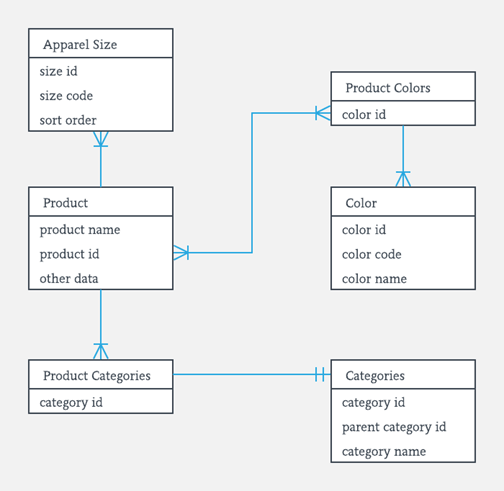
- Lý do nên sử dụng Sơ đồ ER:
    - Giúp **mô tả** các thực thể, thuộc tính, mối quan hệ.
    - Sơ đồ ER có thể dịch thành các bảng quan hệ, cho phép bạn **xây dựng cơ sở dữ liệu một cách nhanh chóng.**
    - Người thiết kế cơ sở dữ liệu **hiểu rõ hơn về thông tin có trong cơ sở dữ liệu** với sự trợ giúp của sơ đồ ERP.
    - Sơ đồ ERD cho phép bạn **giao tiếp với cấu trúc logic** của cơ sở dữ liệu tới người dùng.
### 2. Các kí hiệu trong sơ đồ ER
#### 2.1 Thực thể, thuộc tính, mối quan hệ

- Từ hình ảnh, ta thấy: 
    - Hình chữ nhật: Thực thể hoặc thực thể mạnh.
    - Hình chữ nhật lồng nhau: Thực thể yếu.
    - Hình thoi: Mối quan hệ
    - Hình thoi lồng nhau: Mỗi quan hệ yếu
    - Hình Elip: Thuộc tính
    - Hình Elip lồng nhau: Thuộc tính có đa giá trị
#### 2.2 Một số kí hiệu khác của thuộc tính
##### 2.2.1 Chữ được gạch dưới
- Mỗi dữ liệu đều có giá trị duy nhất, thường sẽ là ID
- Thường sẽ là khóa ràng buộc(Unikey key), thuộc tính ràng buộc(Unikey attribute), khóa chính(Primary Key), định danh(Indentifier). Khi đó ta chọn một trong số đó làm khóa chính
- Ví dụ: Mã sinh viên, số CCCD đều có giá trị duy nhất, ta có thể chọn 1 cái làm khóa chính
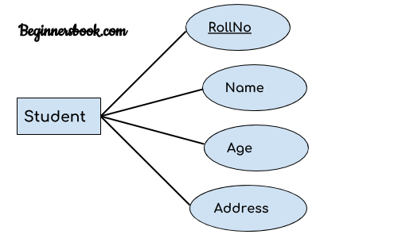
> RollNo là Roll Number hay là Mã sinh viên.

##### 2.2.2 Chữ được gạch dưới đứt quãng
- Đó là Partial Key, nó **không thể dùng để xác định được Entity** vì nó phụ thuộc vào Key (unique attribute) của một Entity khác để truy cập đúng dữ liệu mình muốn.
- Ví dụ như phố Huế có nhà số 4, phố Cổ cũng có có nhà số 4 thì dựa vào số 4 thì không thể truy cập đúng dữ liệu
- Để biết là cái Partial Key phụ thuộc vào Unique Key của Entity nào thì tìm cái hình thoi (mối liên kết) cũng có 2 viền. Đầu kia của cái hình thoi là cái Entity có Unique Key ta cần tìm.

> Bộ 4 cái: **Hình chữ nhật 2 viền + attribute gạch dưới đứt quãng + hình thoi 2 viền + Unique key** luôn đi với nhau.

##### 2.2.3 Hình Elip có viền gạch đứt quãng
- Đó là Derived(Thuộc tính có nguồn gốc), nghĩa là không cần thu thập data cho nó mà có thể suy ra từ một Attribute khác trong Database.
- Ví dụ: Dựa vào ngày sinh, ta có thể suy ra người đó bao nhiêu tuổi.

##### 2.2.4 Chữ được đóng mở ngoặc
- Đó là Attibute Composite(Thuộc tính tổng hợp), cái thuộc tính này được tạo ra từ những thuộc tính khác.
- Ví dụ: ClientName = FirstName + LastName
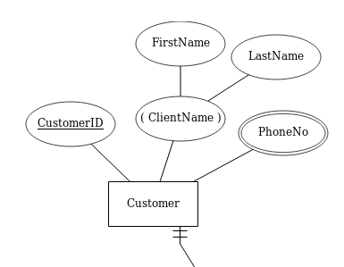
### 3. Các thành phân cơ bản của lược đồ E-R
#### 3.1 Thực thể(Entity) và tập thực thể(Entity set)
##### a. Thực thể 
- Entity hay thực thể là bất cứ các đối tượng, sự vật hay sự việc. Đặc điểm của các thực thể là phải có một thuộc tính và một khóa duy nhất
- Ví dụ: Học sinh, sinh viên, giảng viên
- Các thực thể được phân loại là Thực thể mạnh (Strong entity) và thực thể yếu (Weak entity)
- Thực thể mạnh:
    - Một thực thể mạnh chỉ có thể được xác định bằng các thuộc tính của chính nó
- Thực thể yếu:
    - Thực thể yếu là một loại thực thể không có thuộc tính khóa của nó. Nó có thể được xác định duy nhất bằng cách xem xét khóa chính của một thực thể khác.
    => các tập hợp thực thể yếu cần phải tham gia cùng các thực thể khác
    
##### b. Tập thực thể(Entity set)
- Entity set (Tập thực thể) là một nhóm các thực thể giống nhau. Nó có thể chứa các thực thể với những thuộc tính tương tự. Tất cả các thuộc tính đều có giá trị riêng biệt.
- Ví dụ: Một thực thể sinh viên có thể có tên, tuổi, lớp, dưới dạng các thuộc tính.
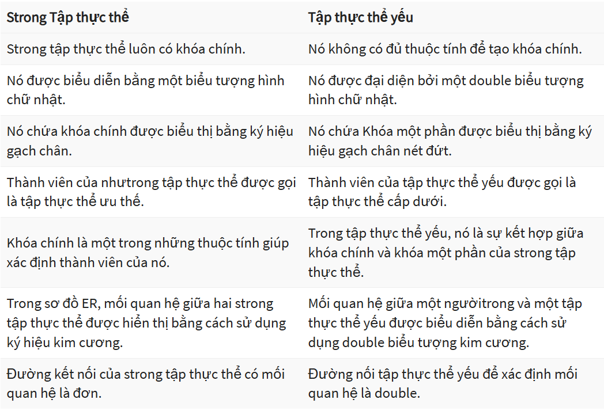
#### 3.1 Thuộc tính(Attribute)
- Nó là thuộc tính có giá trị đơn của loại thực thể hoặc loại mối quan hệ.
- Ví dụ: một bài giảng có thể có các thuộc tính: thời gian, ngày tháng, thời lượng, địa điểm, v.v.

#### 3.2 Mối quan hệ(Relationship)
- Mối quan hệ  là sự liên kết giữa hai hoặc nhiều thực thể.
- Ví dụ: Tom làm việc ở khoa Hóa học.

### 4. Các kiểu liên kết trong lược đồ E-R
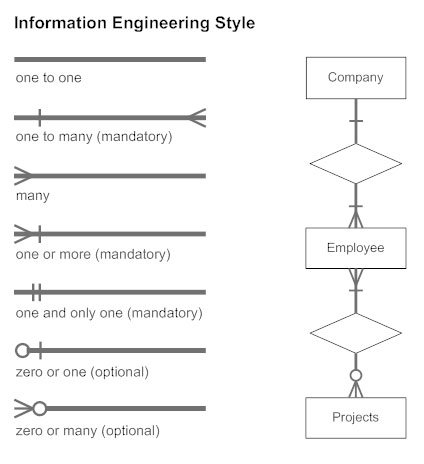
#### 4.1 Liên kết một - một
- Một thực thể từ tập thực thể X có thể được liên kết với nhiều nhất một thực thể của tập thực thể Y và ngược lại.
- Ví dụ: Một sinh viên có thể đăng ký nhiều môn học. Tuy nhiên, tất cả các khóa học đó đều có một dòng duy nhất dành cho một học sinh đó.

#### 4.2 Liên kết một nhiều
- Một thực thể từ tập thực thể X có thể được liên kết với nhiều thực thể của tập thực thể Y, nhưng một thực thể từ tập thực thể Y có thể được liên kết với ít nhất một thực thể.
Ví dụ: một lớp có nhiều học sinh.

#### 4.3 Nhiều thành một
- Nhiều thực thể từ tập thực thể X có thể được liên kết với nhiều nhất một thực thể của tập thực thể Y.
- Ví dụ một học sinh có nhiều lớp

#### 4.4 Nhiều với nhiều
- Một thực thể từ X có thể được liên kết với nhiều thực thể từ Y và ngược lại.

### 5. Xây dựng mô hình ERD
- Các bước để tạo sơ đồ ER

- Ví dụ: Trong một trường đại học, một Sinh viên đăng kí vào các Khóa học. Một sinh viên phải được đăng kí cho ít nhất một hoặc nhiều Khóa học. Mỗi khóa học được giảng dạy bởi một Giáo sư duy nhất. Để duy trì chất lượng giảng dạy, một Giáo sư chỉ có thể cung cấp một khóa học

- Bước 1: Nhận dạng thực thể
    - Sinh viên
    - Khóa học
    - Giáo sư
    
- Bước 2: Xác định mối quan hệ
    - Sinh viên được chỉ định một khóa học
    - Giao sư cung cấp một khóa học
    
- Bước 3: Xác định số lượng
    - Một học sinh có thể được chỉ định nhiều khóa học
    - Một giáo sư chỉ có thể cung cấp một khóa học
    
- Bước 4: Xác định thuộc tính
    
    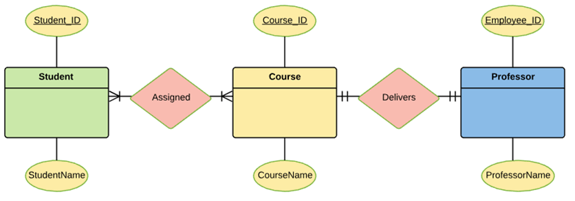
    - Ngoài ra có một số thuộc tính khác như sinh viên có giới tính, quê quán, ngày sinh,...
- Bước 5: Tạo sơ đồ ERD
    
## III. Mô hình dữ liệu quan hệ(Relational data model - RDM)
### 1. Tổng quan
- RDM biểu diễn cơ sở dữ liệu dưới dạng một tập hợp các **quan hệ(bảng giá trị)** nhằm mục đích **lưu trữ và xử lý dữ liệu** trong CSDL.
- Mỗi bảng giá trị có các cột và hàng được gọi lần lượt là **thuộc tính (attributes) và bộ giá trị (tuples).**
### 2. Mội số điểm chính của RDM
- Cơ sở dữ liệu là một tập hợp các quan hệ có liên quan (bảng giá trị).
- Mỗi quan hệ có một tên gọi riêng cho biết loại tuple (bộ dữ liệu) mà quan hệ có. 
- Mỗi quan hệ có một tập hợp các thuộc tính (tên cột) đại diện cho các tính chất hoặc các đặc trưng của từng thực thể.
- Một bộ – tuple (hàng) biểu diễn một thực thể với các các giá trị tương ứng với từng thuộc tính.
- Mỗi cột trong bảng còn được gọi là một trường (field)
- Ví dụ mô hình dữ liệu quan hệ
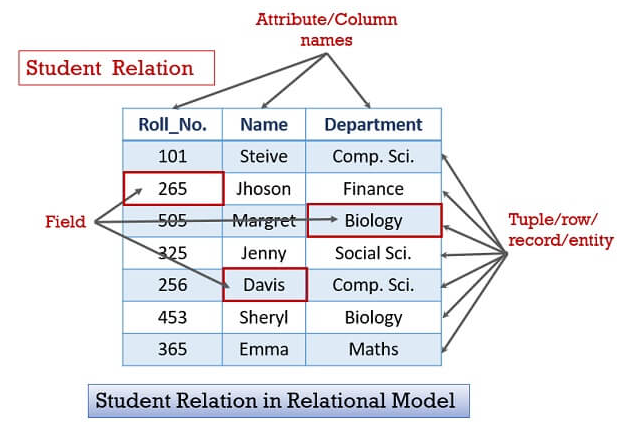
### 3. Đặc điểm của RDM
- Một cơ sở dữ liệu có thể chứa **một số lượng nhất định các quan hệ.** Để giảm thiểu tối đa trường hợp sai sót, **mỗi quan hệ phải được xác định là duy nhất.** Dưới đây là một số đặc điểm giúp tự động phân biệt các quan hệ trong cơ sở dữ liệu:
    - Mỗi quan hệ trong cơ sở dữ liệu **phải có một tên riêng biệt** và duy nhất để phân biệt nó với các quan hệ khác trong cơ sở dữ liệu.
    - Một quan hệ **không được có hai thuộc tính trùng tên.** Mỗi thuộc tính phải có một tên riêng biệt.
    - Trong một quan hệ **không được xuất hiện các bộ giá trị trùng lặp.**
    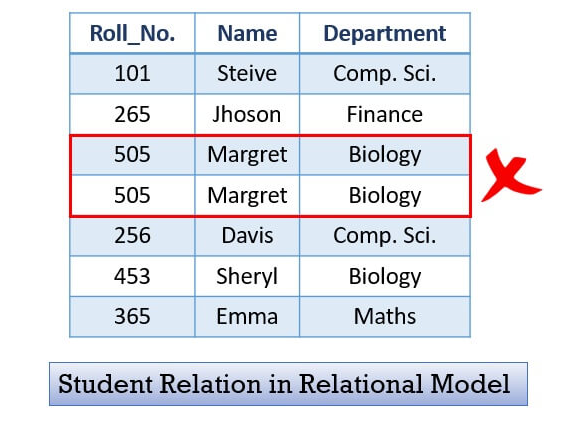
    - Mỗi bộ phải có **chính xác một giá trị dữ liệu cho một thuộc tính.**
    
    - Các bộ (tuples) hay các thuộc tính (attributes) trong một quan hệ đều **không nhất thiết phải tuân theo một thứ tự nhất định.**
### 4. Các ràng buộc trong RDM
- Ràng buộc chính là **những hạn chế được chỉ định cho các giá trị dữ liệu** trong cơ sở dữ liệu quan hệ. Có thể kể đến các ràng buộc chính như sau:
#### 4.1 Inherent Model-Based Constraints (Ràng buộc dựa trên mô hình vốn có)
- Một quan hệ trong cơ sở dữ liệu không được có các bộ giá trị trùng lặp, tuy nhiên, không có bất cứ ràng buộc nào trong thứ tự của các bộ giá trị và thuộc tính.
#### 4.2 Schema-Based Constraints (Ràng buộc dựa trên lược đồ): 
- Các ràng buộc dựa trên lược đồ là những ràng buộc được xác định khi thiết kế lược đồ của cơ sở dữ liệu bằng cách **sử dụng ngôn ngữ định nghĩa dữ liệu (DDL - Data Definition Language).** Các ràng buộc này giúp **đảm bảo tính toàn vẹn và nhất quán của dữ liệu trong cơ sở dữ liệu.** Dưới đây là các loại ràng buộc phổ biến:
##### a. Domain Constraints (Ràng buộc miền):
- Ràng buộc miền xác định loại dữ liệu và giá trị hợp lệ cho một cột (thuộc tính) trong bảng.
- Ví dụ: Một cột tuổi (age) phải là số nguyên và nằm trong khoảng từ 0 đến 120.
##### b. Key Constraints (Ràng buộc khóa):
- Ràng buộc khóa đảm bảo rằng mỗi hàng (bộ) trong bảng là duy nhất.
- Ví dụ: Khóa chính (primary key) đảm bảo không có hai hàng nào trong bảng có cùng giá trị cho một hoặc nhiều cột được chỉ định làm khóa chính.
##### c. Entity Integrity Constraints (Ràng buộc tính toàn vẹn thực thể):
- Ràng buộc này đảm bảo rằng mỗi bảng phải có một khóa chính và giá trị của khóa chính không được phép là giá trị null.
- Ví dụ: Mỗi bảng học sinh phải có một mã số học sinh (student ID) duy nhất và không được để trống.
##### d. Referential Integrity Constraints (Ràng buộc toàn vẹn tham chiếu):
- Ràng buộc này đảm bảo rằng giá trị của khóa ngoại (foreign key) phải khớp với giá trị của khóa chính trong bảng khác hoặc là null.
- Ví dụ: Một cột mã lớp học (class ID) trong bảng sinh viên phải khớp với một giá trị mã lớp học tồn tại trong bảng lớp học.
##### e. Null Value Constraints (Ràng buộc trên giá trị rỗng):
- Ràng buộc này xác định xem một cột có thể chứa giá trị null hay không.
- Ví dụ: Một cột địa chỉ email (email address) trong bảng người dùng có thể được yêu cầu không được để trống, tức là không được phép chứa giá trị null.
#### 4.3 Application-based Constraints (Ràng buộc dựa trên ứng dụng)
- Các ràng buộc không thể áp dụng trong khi xác định lược đồ cơ sở dữ liệu sẽ được thể hiện trong các chương trình ứng dụng.
- Một ứng dụng có thể kiểm tra các giá trị người dùng nhập vào để **đảm bảo rằng chúng hợp lệ trước khi gửi chúng vào cơ sở dữ liệu.** Ví dụ: Một ứng dụng đăng ký tài khoản có thể kiểm tra xem mật khẩu có đủ độ dài và bao gồm ký tự đặc biệt hay không.
## IV. Chuẩn hóa dữ liệu: 1NF, 2NK, 3NF
### 1. Chuẩn hóa dữ liệu
- Chuẩn hóa dữ liệu đề cập đến quá trình tổ chức và cấu trúc dữ liệu **theo cách loại bỏ sự trùng lặp, đảm bảo tính nhất quán và giảm thiểu các biến đổi dữ liệu.**
- Nó liên quan đến việc **chia dữ liệu thành các bảng nhỏ hơn, có quan hệ logic với nhau, giảm thiểu sự lặp lại dữ liệu và thiết lập mối quan hệ giữa các bảng này** thông qua các khóa. 
### 2. Lý do cần chuẩn hóa dữ liệu
- **Loại bỏ sự trùng lặp:** Bằng cách loại bỏ dữ liệu trùng lặp, chuẩn hóa giúp giảm yêu cầu lưu trữ, cải thiện hiệu suất truy xuất dữ liệu và giảm nguy cơ không nhất quán. 

- **Đảm bảo tính nhất quán:** Chuẩn hóa cải thiện tính toàn vẹn dữ liệu bằng cách loại bỏ các tình huống không nhất quán có thể xảy ra khi dữ liệu được lưu trữ lặp đi lặp lại.  

- **Đơn giản hóa việc bảo trì:** Bằng cách chia dữ liệu thành các bảng nhỏ hơn, có cấu trúc tốt, chuẩn hóa đơn giản hóa việc quản lý và bảo trì cơ sở dữ liệu.  

- **Hỗ trợ khả năng mở rộng:** Cơ sở dữ liệu chuẩn hóa dễ dàng thích ứng với các sửa đổi, mở rộng và nâng cấp hệ thống trong tương lai.  

### 3. Khóa chính và khóa ngoại
- Trong thiết kế cơ sở dữ liệu, **khóa chính là một cột hoặc tổ hợp nhiều cột định danh duy nhất từng hàng trong một bảng.** 
- Trong khi đó, **khóa ngoại là một cột hoặc các cột trong một bảng, tham chiếu đến khóa chính trong một bảng khác, thiết lập mối quan hệ giữa hai bảng.**
- Ví dụ: Trong hình dưới, cột CustomerID là khóa chính của bảng Customers và là khóa ngoại của bảng Orders, tạo ra mối liên kết giữa hai bảng. 
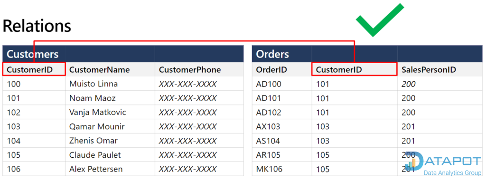
### 4. Chuẩn hóa đầu tiên(1NF)
- Dạng chuẩn hóa đầu tiên yêu cầu mỗi cột trong bảng chỉ chứa các giá trị nguyên tử (không thể phân tách), và **không có nhóm dữ liệu lặp lại hay  mỗi thuộc tính của bảng phải chứa một giá trị duy nhất.**  
- Ví dụ:
    - Bảng dữ liệu trước khi được chuẩn hóa 1NF
    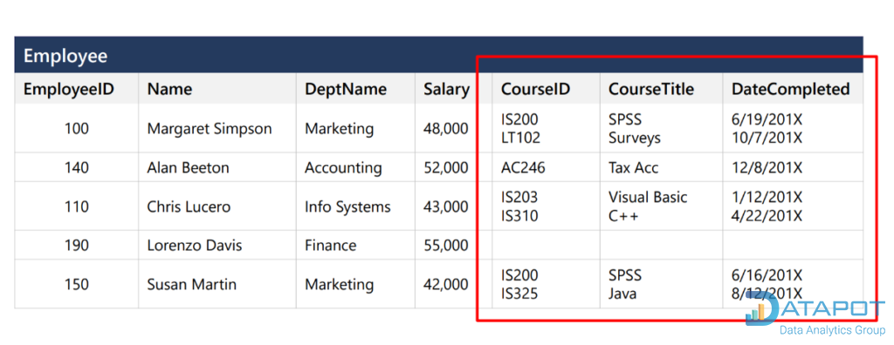
    - Bảng dữ liệu sau khi được chuẩn hóa 1NF 
    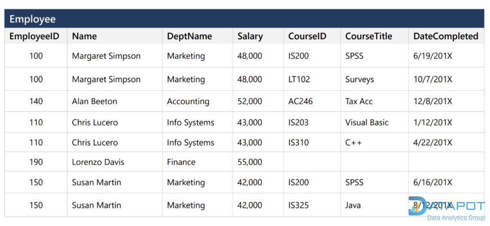
### 5. Chuẩn hóa thứ hai(2NF)
- Dạng chuẩn hóa thứ hai xây dựng trên cơ sở của 1NF bằng cách loại bỏ các phụ thuộc một phần. Phụ thuộc một phần xảy ra khi một thuộc tính **phụ thuộc vào chỉ một phần của khóa chính.**
- Để đạt được 2NF, bảng nên được chia thành các bảng riêng biệt, trong đó **mỗi thuộc tính phụ thuộc hoàn toàn vào toàn bộ khóa chính.**
- Ví dụ: 
    - Trong bảng Employee, các cột Name (Tên nhân sự), Dept_name (Tên phòng ban), Salary (Mức lương) phụ thuộc vào cột EmployeeID (Mã nhân sự). 

    - Trong bảng Emp_Crs, các cột EmployeeID (Mã nhân sự), CourseID (Mã khóa học) và DateCompleted (Ngày hoàn thành khóa học) phụ thuộc vào cột ID. 

    - Trong bảng Course (Khóa học), cột Course_Title (Tên khóa học) phụ thuộc vào cột Course_ID (Mã khóa học). 
    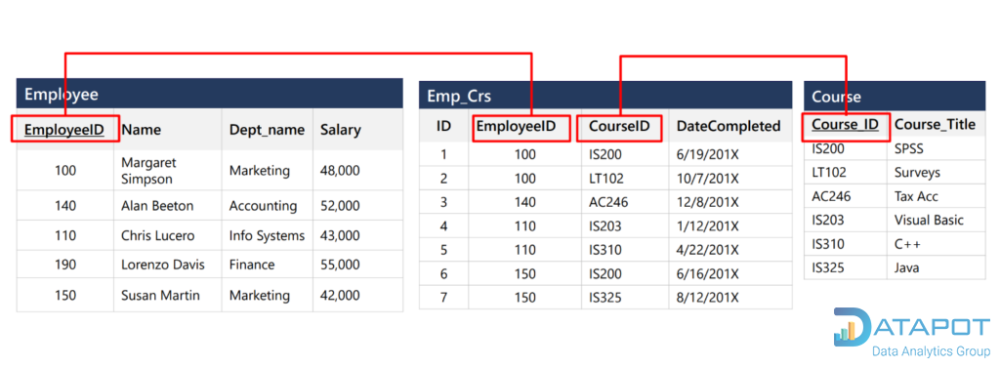
### 6. Chuẩn hóa thứ ba(3NF)
- Dạng chuẩn hóa thứ ba tiếp tục **cải thiện cấu trúc bảng bằng cách loại bỏ các phụ thuộc chuyển tiếp.** Phụ thuộc chuyển tiếp xảy ra khi **một thuộc tính phụ thuộc vào một thuộc tính khác không phải là khóa chính.** 
- Ví dụ: Bảng thông tin đơn hàng ở dưới chưa được chuẩn hóa 3NF, ta thấy có cột OrderID (Mã đơn hàng) là khóa chính nhưng các cột CustomerName (Tên khách hàng), CustomerCountry (Quốc gia của khách hàng) vẫn phụ thuộc vào cột khóa ngoại là CustomerID (Mã khách hàng). 

- Để chuẩn hóa 3NF, ta tách các cột chứa thông tin về khách hàng thành một bảng khác như sau: 
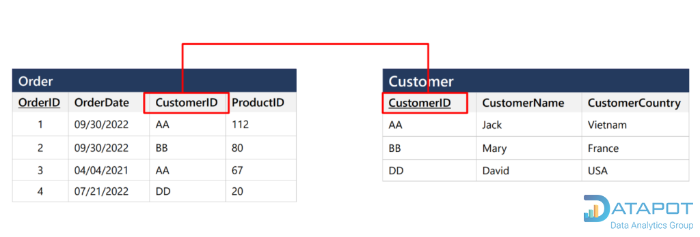