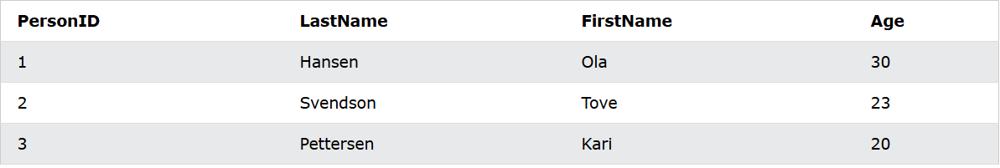
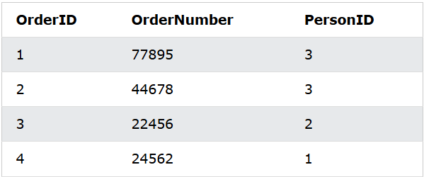
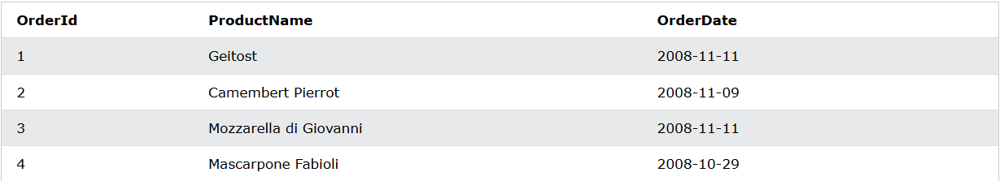
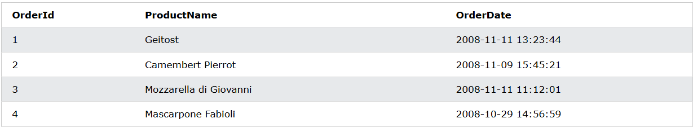

# SQL sever
## Nội dung:
- SQL tutorial
- SQL database
- SQL references
- SQL Example

## I. SQL tutorial
## II. SQL database
### 1. Create DB
    ```sql
    CREATE DATABSE DATABASENAME
    ```
### 2. Drop DB
    ```sql
    DROP DATABASE DBNAME
    ```
### 3. Backup DB
    ```sql
    BACKUP DATABASE DBNAME
    TO DISK = 'filename'
    ```
- Example:
    ```sql
    backup database LibraryUser
    to disk = 'E:\backup\testdb.bak'
    ```
- SQL backup with diffential statement: bản backup từ bản thay đổi gần nhất
    ```sql
    BACKUP DATABASE DBNAME
    TO DISK = 'FILENAME'
    WITH DIFFIRENTIAL
    ```
### 4. Create table
- Tạo bảng mới
    ```sql
    create table table_name(
        column1 datatype
        column2 datatype
        ...
    );

    Ex: create table person(
        id int,
        lastName varchar(255),
        firstName varchar(255),
        address varchar(255),
        city varchar(255)
    );
    ```
- Tạo bảng từ bảng có sẵn
    ```sql
    select * into tb1 from tb2

    Ex: select id, lastName into per1 from per2
    ```
### 5. Drop table
- delete table
    ```sql
    drop table table_name
    ```
- delete data in table, not table - truncate table
    ```sql
    truncate table table_name
    ```
### 6. Alter table
- The **ALTER TABLE** statement is used to add, delete, or modify columns in an existing table.
- The **ALTER TABLE** statement is also used to add and drop various constraints(Hạn chế) on an existing table.
#### a. Add column
- Syntax

    ```sql
    alter table table_name
    add column_name dttype

    Ex:
    alter table UserLibrary
    add city varchar(255)
    ```
#### b. Drop column
- Syntax

    ```sql
    alter table tb_name
    drop column column_name

    Ex:
    alter table UserLibrary
    drop column city 
    ```
#### c. Rename table
- Syntax

    ```sql
    EXEC sp_rename 'table_name.old_name',  'new_name', 'COLUMN';

    Ex:
    exec sp_rename 'UserLibrary.email', 'gmail', 'column';
    ```
#### d. Alter datatype column
- Syntax

    ```sql
    alter table tb_name
    alter column column_name datatype

    Ex:
    alter table UserLibrary
    alter column gmail int
    ```
### 7. Constrains(Ràng buộc)
- SQL constraints are used to specify rules for the data in a table.

- Constraints are used to limit the type of data that can go into a table. This ensures the accuracy and reliability of the data in the table. If there is any violation(Vi phạm) between the constraint and the data action, the action is aborted(Loại bỏ).

- Constraints can be column level or table level. Column level constraints apply to a column, and table level constraints apply to the whole table.

- The following constraints are commonly used in SQL:
    - **NOT NULL** - Ensures that a column cannot have a NULL value
    - **UNIQUE** - Ensures that all values in a column are different
    - **PRIMARY KEY** - A combination of a NOT NULL and UNIQUE. Uniquely identifies(Xác định duy nhất) each row in a table
    - **FOREIGN KEY** - Prevents actions that would destroy links between tables
    - **CHECK** - Ensures that the values in a column satisfies a specific condition
    - **DEFAULT** - Sets a default value for a column if no value is specified
    - **CREATE INDEX** - Used to create and retrieve(Lấy lại) data from the database very quickly
    ```sql
    CREATE TABLE table_name (
        column1 datatype constraint,
        column2 datatype constraint,
        column3 datatype constraint,
        ....
    );
    ```
#### a. Not null
- On create table
    ```sql
    CREATE TABLE Persons (
        ID int NOT NULL,
        LastName varchar(255) NOT NULL,
        FirstName varchar(255) NOT NULL,
        Age int
    );
    ```
- On alter table
    ```sql
    alter table tb_name
    alter column name_column datatype not null

    Ex:
    alter table Persons
    alter column id int not null
    ```
#### b. Unique constraint
- Overview
    - The **UNIQUE** constraint ensures that all values in a column are different.
    - Both the **UNIQUE and PRIMARY KEY** constraints provide a guarantee for uniqueness(Đảm bảo tính duy nhất) for a column or set of columns.
    - **A PRIMARY KEY** constraint automatically has a **UNIQUE constraint**.
    - However, you can have **many UNIQUE constraints** per table, but only one **PRIMARY KEY** constraint per table.
- On create table
    - Single column
    ```sql
    create table persons(
        id int not null unique,
        lastName varchar(255) not null,
        firstName varchar(255),
        age int
    );
    ```
    - Multiple column
    ```sql
    create table persons(
        id int not null,
        lastName varchar(255),
        firstName varchar(255),
        age int,
        constraint Uc_person unique (id, lastname)
    )
    ```
- On alter table
    - single column
    ```sql
    alter table table_name
    add unique (column_name);
    ```
    - multiple column
    ```sql
    alter table tabel_name
    add constraint unique_name unique (column_name1, column_name2)
    ```
- Drop unique constraint
    ```sql
    alter table table_name
    drop constraint name_unique
    ```
#### c. Primary key
- Overview
    - The PRIMARY KEY constraint uniquely **identifies each record** in a table.
    - Primary keys **must contain UNIQUE values**, and **cannot contain NULL values**.
    - A table can have **only ONE primary key**; and in the table, this primary key can **consist of single or multiple columns (fields).**
- On create table
    - Single column
    ```sql
    create table tb_name(
        column1 datatype1 not null primary key,
        column2 datatype2,
        column3 datatype3,
        ...
    );
    ```
    - Multiple column
    ```sql
    create table persons(
        column1 datatype1,
        column2 datatype2,
        column3 datatype3,
        constraint pk_name primary key (column1, column2,...)
    )

    Ex:
    create table person(
        id int not null,
        name varchar(255), 
        age int,
        constraint pk_person primary key (id, name)
    )
    ```
- **Note:** In the example above there is only ONE PRIMARY KEY (pk_person). However, the VALUE of the primary key is made up of TWO COLUMNS (id + name).
- On alter table
    - Single column
    ```sql
    alter table tb_name
    add primary key (column_name)
    ```
    - Multiple column
    ```sql
    alter table tb_name
    add constraint pk_name primary key (id, name);
    ```
    - **Note:** If you use ALTER TABLE to add a primary key, the primary key column(s) must have been declared to not contain NULL values (when the table was first created).
- Drop a primary key
    ```sql
    alter table tb_name
    drop constraint pk_person
    ```
#### d. Foreign key
- Overview
    - The FOREIGN KEY constraint is used to **prevent actions that would destroy links between tables.**
    - A FOREIGN KEY is **a field (or collection of fields)** in one table, that refers to the PRIMARY KEY in another table.
    - The table with the foreign key is called **the child table**, and the table with the primary key is called **the referenced(được tham chiếu) or parent table.**
- Look at the following two tables:
    - Persons Table
    
    - Orders Table
    
- **Note:**
    - Notice that the "PersonID" column in the "Orders" table points to the "PersonID" column in the "Persons" table.
    - The "PersonID" column in the "Persons" table is the PRIMARY KEY in the "Persons" table.
    - The "PersonID" column in the "Orders" table is a FOREIGN KEY in the "Orders" table.
    - The FOREIGN KEY constraint prevents invalid data from being inserted into the foreign key column, because it has to be one of the values contained in the parent table.
- On create table
    - Single column

    ```sql
    create table orders(
        orderID int not null primary key, 
        name varchar(255),
        personID int foreign key references persons(personID)
    );
    ```

    - Multiple column

    ```sql
    create table order(
        orderID int not null,
        name varchar(255),
        personID int,
        primary key(orderID),
        constraint fk_order foreign key(personID) references person(personID)
    )
    ```
- On alter table
    - Single column

    ```sql
    alter table tb_name
    add foreign key(column_name) references tb_name2(column_name)
    ```

    - Multiple column

    ```sql
    alter table tb_name
    add constraint fk_name foreign key(column_name) references tb_name2(column_name)
    ```
#### e. Check
- Overview
    - The CHECK constraint is used to **limit the value range** that can be placed(Đặt) in a column.

    - If you define a CHECK constraint on a column it will allow only certain(Nhất định) values for this column.

    - If you define a CHECK constraint on a table it can limit the values in certain columns based on values in other columns in the row.
- On create table
    - Single column

    ```sql
    create table tb1(
        id int not null,
        name varchar(255),
        age int check(age>=18)
    );
    ```
    - Multiple column
    ```sql
    create table tb2(
        id int not null,
        name varchar(255),
        age int,
        constraint chk_name check (age>=18 and name ='Minh')
    );
    ```
- On alter table
    - Single table
    ```java
    alter table tb2
    add check(age>=20) 
    ```
    - Multiple table
    ```java
    alter table tb2
    add constraint ch_name check (age>= 21 and name ='Ming')
    ```
- Drop check constraint
    ```java
    alter table tb2
    drop constraint ch_name
    ```
#### f. Default constraint
- Overview
    - The DEFAULT constraint is used to set a default value for a column.
    - The default value will be added to all new records, if no other value is specified(Chỉ định).
- On create table
    ```sql
    create table tb3(
        id int not null,
        name varchar(255),
        age int,
        city varchar(255) default 'HaNoi'
    );
    create table tb3(
        id int not null,
        name varchar(255),
        age int,
        city varchar(255) default 'HaNoi'
        datatb data default getDate()
    );
    ```
- On create table
    ```sql
    alter table person
    add constraint df_city default 'HCM' for city
    ```
- Drop default constraint(Chưa chạy đc)
    ```sql
    alter table tb_name
    alter column column_name drop default
    ```
#### g. Index
- Overview
    - The CREATE INDEX statement is used to create indexes in tables.
    - Indexes are used to retrieve data from the database more quickly than otherwise. The users cannot see the indexes, they are just used to speed up searches/queries.
    - **Note:** Updating a table with indexes takes more time than updating a table without (because the indexes also need an update). So, only create indexes on columns that will be frequently searched against.
- Create unique index
    ```sql
    create unique index index_name
    on table_name (column1, column2,...);
    ```
    Ex:
    ```sql
    create index idx_pname
    on table_name (LastName, FirstName);
    ```
- Drop idex
    ```sql
    drop index table_name.index_name;
    ```
### 8. Auro Increment
#### a. Overview
- Auto-increment allows a unique number to be generated automatically when a new record is inserted into a table.
- Often this is the primary key field that we would like to be created automatically every time a new record is inserted.
#### b. Example
- Ex:
    ```sql
    create table tb2(
        id int identity(1, 1) primary key,
        name varchar(255) not null,
        age int
    );
    ```
- **Note:**
    - The MS SQL Server uses the **IDENTITY keyword** to perform an auto-increment feature.
    - In the example above, the starting value for IDENTITY is 1, and it will increment by 1 for each new record.
    - To insert a new record into the table, we will NOT have to specify a value for the column (a unique value will be added automatically).
### 9. Date
#### a. Overview
- The most difficult part when working with dates is to be sure that the format of the date you are trying to insert, matches the format of the date column in the database.
- As long as your data contains only the date portion(Phần thời gian), your queries will work as expected. However, if a time portion is involved(Liên quan đến phần nào đó), it gets more complicated.
#### b. Date data
- DATE - format YYYY-MM-DD
- DATETIME - format: YYYY-MM-DD HH:MI:SS
- SMALLDATETIME - format: YYYY-MM-DD HH:MI:SS
- TIMESTAMP - format: a unique number
#### c. Example
##### Example 1
- OrdersTable1


- Now we want to select the records with an OrderDate of "2008-11-11" from the table above.
    ```sql
    SELECT * FROM Orders WHERE OrderDate='2008-11-11'
    ```
- **Note:** Note: Two dates can easily be compared if there is no time component involved!
##### Example 2
- OrdersTable2


- If we use the same SELECT statement as above:
    ```sql
    SELECT * FROM Orders WHERE OrderDate='2008-11-11'
    ```
> we will get no result! This is because the query is looking only for dates with no time portion.
### 10. Views
#### a. Overview
- In SQL, a view is a virtual table based on the result-set(Tập kết quả) of an SQL statement.
- A view contains rows and columns, just like a real table. The fields(Trường) in a view are fields from one or more real tables in the database.
- You can add SQL statements and functions to a view and present the data as if(Như thể) the data were coming from one single table.
#### b. Create view
- Syntax
    ```sql
    CREATE VIEW view_name AS
    SELECT column1, column2, ...
    FROM table_name
    WHERE condition;
    ```
- **Note:** A view always shows up-to-date data! The database engine recreates the view, every time a user queries it.(Tự tạo lại mỗi lần truy cập nó).
- **Example:**
    ```sql
    create view [view1] as 
    select id, name
    from tb2
    ```
#### c. Update view(SQL sever khoong co)
- Syntax
    ```sql
    CREATE OR REPLACE VIEW view_name AS
    SELECT column1, column2, ...
    FROM table_name
    WHERE condition;
    ```
- Example
    ```sql
    ```
#### d. Drop view
- Syntax
    ```sql
    drop view view_name
    ```
- Example
    ```sql
    drop view [view1]
    ```
## III. SQL references
## IV. SQL example