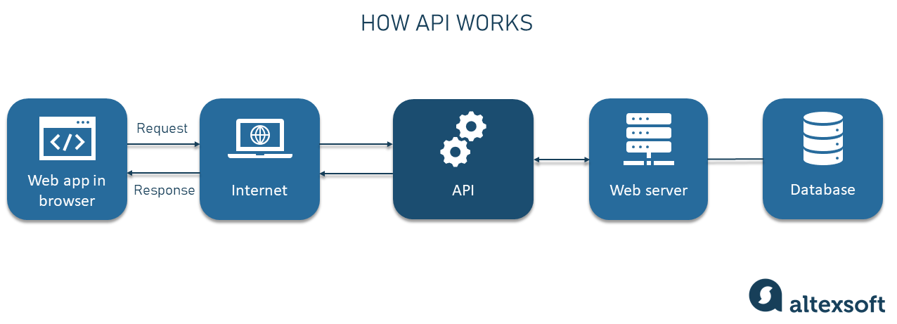
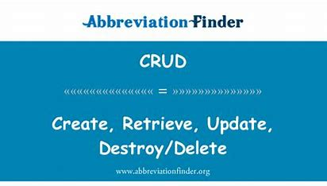
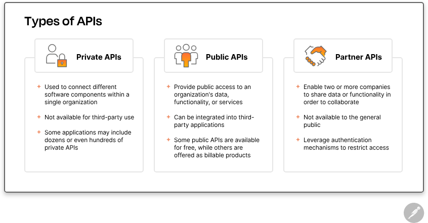
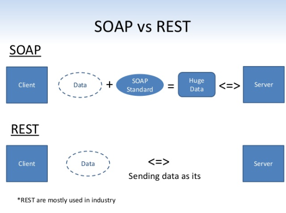
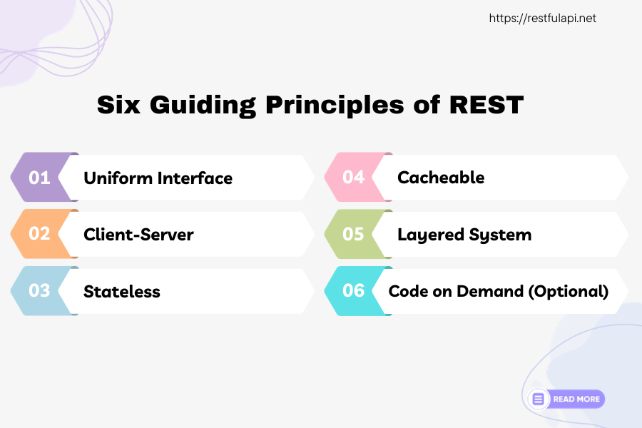
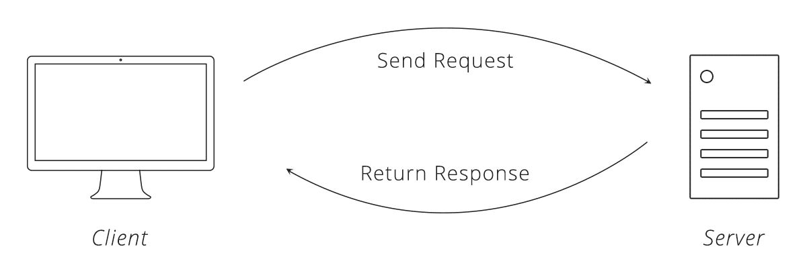

# BUỔI 1 Kiến thức cơ bản
## 🎯 Nội dung cần chuẩn bị.
- API, RestAPI
- HTTP
- Các method trong HTTP
- Reponse, Request
- Design patern : DI, IOC
- (Không bắt buộc) Coding convention

## I. API, RestAPI
### 1. API
- **API(Application Programming Interface – giao diện lập trình ứng dụng)** là các phương thức, giao thức kết nối với các thư viện và ứng dụng khác. API cung cấp khả năng truy xuất đến một tập các hàm hay dùng. Và từ đó có thể trao đổi dữ liệu giữa các ứng dụng.
- Ví dụ api như menu nhà hàng, khách hàng xem menu(các api) và gửi yêu cầu cho nhà hàng, đầu bếp sẽ nhận yêu cầu và trả về món ăn mà khác hàng yêu cầu.

    
- Hay các app thanh toán điện tử, ngân hàng sẽ cung cấp một api, khi thanh toán thì app điện tử sẽ gọi api cung cấp bởi ngân hàng và trừ tiền.
### 2. Cách API hoạt động
- **API** hoạt động bằng cách chia sẻ dữ liệu giữa các ứng dụng, hệ thống và thiết bị. Điều này xảy ra thông qua **một chu kỳ yêu cầu và phản hồi**. Yêu cầu được gửi tới API để **lấy dữ liệu và trả lại cho người dùng.**

    
#### a. API client
- **API clients** chịu trách nhiệm bắt đầu cuộc trò chuyện bằng cách gửi yêu cầu đến máy chủ API. Yêu cầu có thể được kích hoạt theo nhiều cách. 
- **Ví dụ:** Người dùng có thể bắt đầu yêu cầu API bằng cách nhập cụm từ tìm kiếm hoặc nhấp vào nút hoặc thông báo từ ứng dụng khác.
#### b. API request
- **API request** sẽ có giao diện và hoạt động khác nhau tùy thuộc vào loại API, nhưng thường sẽ bao gồm các thành phần sau:

    - **Endpoint:** là một URL chuyên dụng cung cấp quyền truy cập vào một tài nguyên cụ thể.

         

    - **Method:** Cho biết loại hoạt động mà máy khách muốn thực hiện trên một tài nguyên nhất định. Ví dụ như **truy xuất, tạo, cập nhật và xóa dữ liệu.**

         

    - **Parameters:** Các biến được chuyển đến điểm cuối API để cung cấp hướng dẫn cụ thể để API xử lý. Các tham số này có thể được đưa vào **yêu cầu API như một phần của URL**, trong chuỗi truy vấn hoặc trong nội dung yêu cầu.

        
    
    - **Request headers:** là cặp khóa-giá trị cung cấp thêm thông tin chi tiết về yêu cầu, chẳng hạn như loại nội dung hoặc thông tin xác thực.

        ```java
        POST /api/v1/resource HTTP/1.1
        Host: example.com // Tên miền sever được yêu cầu
        Content-Type: application/json // loại nội dung của dữ liệu gửi yêu cầu
        Authorization: Bearer <token> // Thông tin xác thực để truy cập tài nguyên
        ```
    - **Request body:** Phần chính của yêu cầu và nó bao gồm dữ liệu thực tế cần thiết để tạo, cập nhật hoặc xóa tài nguyên. Ví dụ như muốn tạo một người dùng mới

        ```java
        {
            "name": "Nguyen Van A",
            "email": "nguyenvana@example.com",
            "age": 30
        }
        ```

#### c. API sever
- API client gửi yêu cầu đến API sever, sever này chịu trách nhiệm **xử lý xác thực, xác thực dữ liệu đầu vào và truy xuất hoặc thao tác dữ liệu.**

#### d. API reponse
- Cuối cùng, API sever sẽ gửi phản hồi cho máy khách(client). API reponse thường bao gồm các thành phần sau:
    - **Status code:** Mã gồm ba chữ số cho biết kết quả của yêu cầu API. Ví dụ: 200, 201, 400 ([status code](https://blog.postman.com/what-are-http-status-codes/#:~:text=HTTP%20status%20codes%20are%20three-digit%20codes%20that%20indicate,that%20helps%20the%20client%20know%20how%20to%20proceed)).

        
    
    - **Response headers:** Giống với tiêu đề yêu cầu, ngoại trừ được sử dụng để **cung cấp thông tin bổ sung về phản hồi của máy chủ.** ([reponse - header](https://blog.postman.com/what-are-http-headers/))

    - **Response body:** Bao gồm dữ liệu hoặc nội dung thực tế mà khách hàng yêu cầu hoặc thông báo lỗi nếu có sự cố.

### 3. Các loại API



- **Private API(API nội bộ):** Được sử dụng để kết nối các thành phần phần mềm khác nhau trong một tổ chức và chúng không có sẵn cho bên thứ ba sử dụng. Ví dụ như một mạng xã hội nó sẽ có api riêng để xử lý đăng nhập,...

- **Public API:** Cung cấp quyền truy cập **công khai vào dữ liệu, chức năng hoặc dịch vụ của tổ chức** mà các nhà phát triển bên thứ ba có thể tích hợp vào ứng dụng của riêng họ. Một số api trả phí, một số api miễn phí. Ví dụ: [api-key-pexels](https://www.pexels.com/api/key/)

- **Partner API:** Cho phép hai hoặc nhiều công ty chia sẻ dữ liệu hoặc chức năng để cộng tác trong một dự án. Ví dụ: ZaloPay hợp tác với MB bank để MB bank cung cấp API cho việc thanh toán.

### 4. API architectural styles(phong cách kiến trúc API)
- **API architectural styles** là các cách tiếp cận khác nhau để thiết kế và phát triển API. Một số phong cách kiến trúc API phổ biến:

    - **REST (Representational State Transfer):** Dựa trên HTTP, sử dụng các phương thức HTTP tiêu chuẩn (GET, POST, PUT, DELETE). Dễ hiểu, sử dụng rộng rãi.
    - **SOAP (Simple Object Access Protocol):** Sử dụng XML để truyền các thông báo có cấu trúc cao giữa máy khách và máy chủ. Sử dụng trong doanh nghiệp, hệ thống cũ bảo mật cao nhưng chậm.

        
    - **GraphQL:** Ngôn ngữ truy vấn nguồn mở cho phép khách hàng tương tác với một điểm cuối API duy nhất để **truy xuất dữ liệu chính xác mà họ cần mà không cần xâu chuỗi nhiều yêu cầu lại với nhau.** Hữu ích chạy trên mạng chậm, không đáng tin cậy.
    
    - **Webhooks:** các yêu cầu được gửi tự động để phản hồi các trình kích hoạt dựa trên sự kiện. Ví dụ: Thanh toán được thực hiện, ứng dụng có thể gửi yêu cầu HTTP đến URL webhook được định cấu hình trước. Sau đó, hệ thống nhận được webhook có thể xử lý sự kiện và thực hiện hành động thích hợp.

    - **gRPC(Remote Procedure Call):** Client có thể gọi sever như thể nó là một đối tượng cục bộ, điều này giúp các ứng dụng và hệ thống phân tán giao tiếp với nhau dễ dàng hơn.

## II. RestAPI
### 1. Khái niệm
- **RestAPI (còn được gọi là RESTful API hoặc web RESTful API)** là giao diện lập trình ứng dụng (API) tuân thủ các nguyên tắc thiết kế của kiểu kiến ​​trúc (REST).
- Rest API cung cấp một cách linh hoạt, nhẹ nhàng để tích hợp các ứng dụng và kết nối các thành phần trong kiến ​​trúc dịch vụ.
### 2. Các nguyên tắc của rest


#### 2.1 **Uniform Interface:** 
- Xác định giao diện nhất quán và thống nhất cho các tương tác giữa máy khách và máy chủ. 
- Ví dụ: API REST dựa trên HTTP sử dụng các phương thức HTTP tiêu chuẩn (GET, POST, PUT, DELETE, v.v.) và  để xác định tài nguyên.

    ```http
    GET /api/users/123 // Chỉ rõ tài nguyên là người dùng với ID 123
    ```
#### 2.2 Client - sever
- Trong thiết kế REST API, ứng dụng máy khách và máy chủ phải hoàn toàn độc lập với nhau. 
- Thông tin duy nhất mà ứng dụng khách nên biết là URI(Uniform Resource Identifier) của tài nguyên được yêu cầu, nó **không thể tương tác với ứng dụng máy chủ theo bất kỳ cách nào khác.** 
- Tương tự, ứng dụng máy chủ không được sửa đổi ứng dụng khách ngoài việc chuyển nó tới dữ liệu được **yêu cầu qua HTTP.**

#### 2.3 Stateless(Không lưu trạng thái)
- Mỗi yêu cầu từ client đến server phải chứa tất cả thông tin cần thiết để server xử lý yêu cầu. 
- Server không lưu trữ trạng thái của client giữa các yêu cầu.

#### 2.4 Cacheable
- Phản hồi phải tự gắn nhãn có thể lưu vào bộ nhớ đệm hoặc không thể lưu vào bộ nhớ đệm để tăng tốc độ và giảm tải yêu cầu đến sever.
#### 2.5 Layered System
- **Layered System** cho phép một kiến ​​trúc bao gồm các lớp phân cấp bằng cách hạn chế hành vi của thành phần.
#### 2.6 Code on demand (optional)
- **Code on Demand** cho phép server gửi mã lệnh đến client để thực thi, giúp client mở rộng chức năng hoặc cập nhật tính năng mà không cần tải lại toàn bộ ứng dụng hoặc dịch vụ. 
- Tuy nhiên, nguyên tắc này là tùy chọn và không bắt buộc trong tất cả các hệ thống REST.

### III. Http và các method trong http
#### 1. Http
- **HTTP (HyperText Transfer Protocol)** là một giao thức truyền tải siêu văn bản được sử dụng rộng rãi trên World Wide Web để truyền tải dữ liệu giữa máy khách (client) và máy chủ (server). 
- HTTP hoạt động dựa trên **mô hình client-server**, trong đó **máy khách gửi yêu cầu (request) đến máy chủ, và máy chủ trả lời bằng cách gửi phản hồi (response).**

#### 2. Các phương thức trong http
##### a. Get
- Sử dụng để yêu cầu truy xuất thông tin từ máy chủ.
- Thông tin được truyền qua URL, an toàn, không làm thay đổi trạng thái sever.

##### b. Post
- Sử dụng để gửi dữ liệu đến server để tạo một tài nguyên mới hoặc thực hiện một hành động nào đó.
- Dữ liệu được gửi trong thân (body) của request, không an toàn (unsafe) và có thể thay đổi trạng thái của server.

##### c. Put
- Sử dụng để thay thế toàn bộ một tài nguyên hiện có bằng một tài nguyên mới.
- Không an toàn và không phải idempotent (có thể gọi nhiều lần mà không thay đổi kết quả).

##### d. Delete
- Sử dụng để xóa một tài nguyên.
- Không an toàn và không phải idempotent.

##### e. Head 
- Giống như GET nhưng chỉ trả về phần header của response, không trả về body.
- Sử dụng để kiểm tra xem một tài nguyên có tồn tại hay không, kích thước của tài nguyên,...

##### f. Options
- Sử dụng để yêu cầu server cho biết các phương thức HTTP mà server hỗ trợ cho một tài nguyên cụ thể.

##### g. Patch
- Sử dụng để cập nhật một phần của một tài nguyên.
- Không an toàn và không phải idempotent.

### IV. Request, reponse


#### 1. Request
- Một request là một yêu cầu gửi đi từ một client (ví dụ: trình duyệt web) đến một server (ví dụ: máy chủ web) để yêu cầu một dịch vụ hoặc thông tin nào đó.
- Các thành phần cơ bản trong request:
    - **Phương thức:** GET, POST, PUT, DELETE, ...
    - **URL:** Địa chỉ của tài nguyên mà client muốn truy cập
    - **Header:** Chứa các thông tin bổ sung về request, như loại trình duyệt, ngôn ngữ, cookie, ...
    - **Body:** Dữ liệu được gửi kèm theo request, thường được sử dụng trong các phương thức như POST để gửi thông tin từ form.
#### 2. Response
- Một response là câu trả lời từ server gửi về cho client sau khi nhận được một request.
- Các thành phần cơ bản trong request:
    - **Status code:** Mã số chỉ trạng thái của response (ví dụ: 200, 404, 500)
    - **Header:** Chứa các thông tin bổ sung về response, như loại nội dung, độ dài nội dung, cookie, ...
    - **Body:** Dữ liệu được gửi kèm theo response, thường là nội dung của trang web, dữ liệu JSON, ...

### V. DI, IOC
#### 1. DI
##### a. Định nghĩa
- **Dependency Injection** là một kỹ thuật để thực hiện Inversion of Control, trong đó các phụ thuộc của một đối tượng được "tiêm" (inject) vào nó từ bên ngoài.
##### b. Các loại DI
- Constructor Injection: Các phụ thuộc được cung cấp thông qua constructor của lớp.
    ```java
    class UserService {
        private UserRepository userRepository;

        public UserService(UserRepository userRepository) {
            this.userRepository = userRepository;
        }
    }
    ```
- **Setter Injection:** Các phụ thuộc được cung cấp thông qua các phương thức setter.
    ```java
    class UserService {
        private UserRepository userRepository;

        public void setUserRepository(UserRepository userRepository) {
            this.userRepository = userRepository;
        }
    }
    ```
- **Field Injection:** Các phụ thuộc được cung cấp trực tiếp vào các trường của lớp (thường sử dụng annotation).
    ```java
    class UserService {
        @Autowired
        private UserRepository userRepository;
    }
    ```
#### 2. IOC
- **Inversion of Control** là một nguyên tắc trong đó điều khiển việc tạo ra và quản lý các đối tượng được chuyển từ phần mã sử dụng đối tượng (client) sang một phần mã khác (container hoặc framework).
<!-- - Ví dụ: Trong một ứng dụng truyền thống, một lớp có thể tạo ra các đối tượng phụ thuộc của nó trực tiếp.
    ```java
    class UserService {
        private UserRepository userRepository;

        public UserService() {
            this.userRepository = new UserRepository(); // Tạo đối tượng trực tiếp
        }
    }
    ``` -->
- Với IoC, đối tượng UserRepository sẽ được cung cấp từ bên ngoài, thường là từ một container IoC.
    ```java
    class UserService {
        private UserRepository userRepository;

        public UserService(UserRepository userRepository) {
            this.userRepository = userRepository; // Nhận đối tượng từ bên ngoài
        }
    }
    ```
