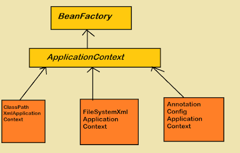
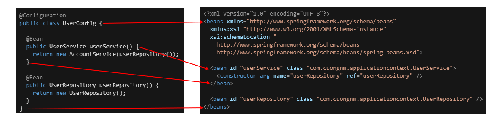
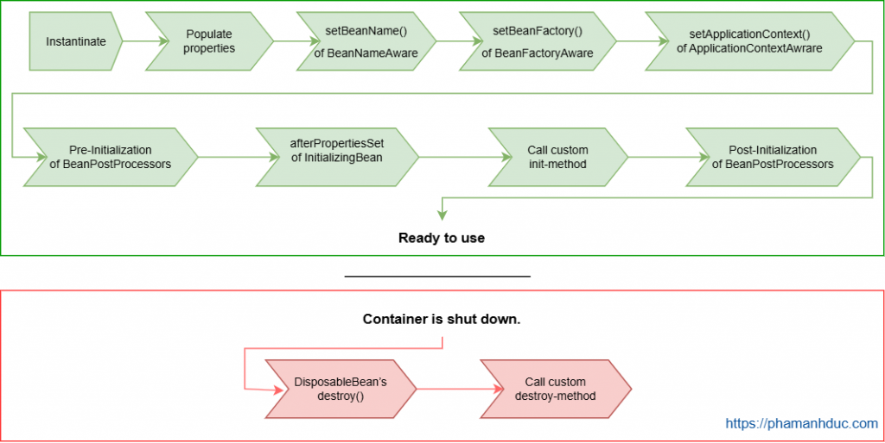
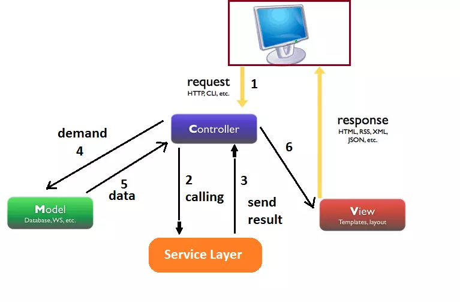
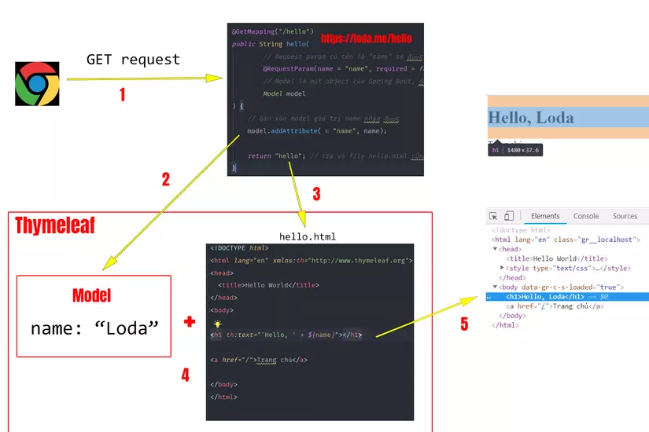
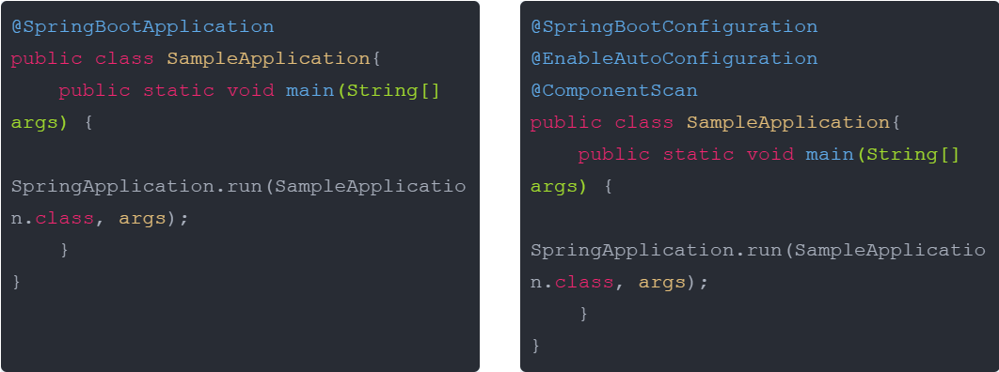
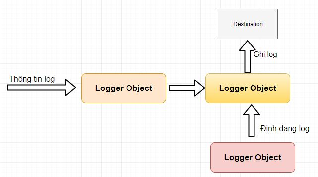

# [BUỔI 2] SPRING MVC
##  Nội dung cần chuẩn bị.
- Khởi tạo dự án SpringBoot
- Bean trong SpringBoot: Bean là gì, BeanFactory là gì, vòng đời của 1 Bean ở trong SpringBoot
- String MVC : @Controller, Thymeleaf
- Annotation trong SpingBoot: @SpringBootApplication, @Component, @Bean, @Autowired
- Lombok: @Getter, @Setter, @ToString, @Data, @Builder, @Constructior
- Log trong SpringBoot : Log4j là gì và Antotation @Slf4j
- Bài tập cần chuẩn bị trước (Bắt buộc): Code 1 trang web giới thiệu thông tin cá nhân sử dụng SpringBoot và Thymeleaf áp dụng mô hình MVC. Lưu ý: Thông tin để hiển thị phải được lấy ra từ Object (Đầu vào có thể hardcode).
## I. Bean, Beanfactory
### 1. Bean
#### a. Tổng quan
> In Spring, the objects that form the backbone of your application and that are managed by the Spring IoC container are called beans. A bean is an object that is instantiated, assembled, and otherwise managed by a Spring IoC container.

- Các đối tượng tạo thành **xương sống** của ứng dụng và được quản lý bởi Spring IoC container được gọi là **Bean**. Một **bean** là một đối tượng được **khởi tạo, lắp ráp, và được quản lý** bởi một Spring IoC container.
- Trong Spring Boot, các Bean thường được cấu hình bằng cách sử dụng các annotation như **@component, @Service, @Repository, @Controller,...**
- Lời ích chính của Bean là khả năng sử dụng Dependency injection để **giảm sự phụ thuộc giữa các lớp, dễ bảo trì, mở rộng.**
#### b. Các thuộc tính trong bean
- class: Chỉ định lớp cụ thể tạo ra đối tượng Bean

    ```xml
    <bean id="myBean" class="com.example.MyClass"/>
    ```

- name: Đặt tên hoặc bí danh cho bean

    ```xml
    <bean id="myBean" name="myBeanAlias" class="com.example.MyClass"/>
    ```

- **scope:** Xác định phạm vi, vòng đời của Bean
    - **singleton(mặc định)**: Chỉ một instance của Bean được tạo cho mỗi Spring IoC container.
    - **prototype**: Một instance mới được tạo mỗi khi Bean được yêu cầu.
    - **request**: Một instance mới cho mỗi HTTP request (chỉ áp dụng cho ứng dụng web).
    - **session:** Một instance mới cho mỗi HTTP session (chỉ áp dụng cho ứng dụng web).
    ```xml
    <bean id="myBean" class="com.example.MyClass" scope="prototype"/>
    ```
- **constructor-arg:** truyền đối số vào constructor của một Bean khi Bean được tạo ra.
    ```xml
    <bean id="myBean" class="com.example.MyClass">
        <constructor-arg value="someValue"/>
    </bean>
    ```
- **properties:** cấu hình các thuộc tính của Bean thông qua setter methods hoặc field injection.
    ```xml
    <bean id="myBean" class="com.example.MyClass">
        <property name="propertyName" value="someValue"/>
    </bean>
    ```
    => Thuộc tính propertyname được thiết lập giá trị someValue
- **autowiring:** xác định cách Spring tự động tiêm (inject) các phụ thuộc vào Bean.
    - **no(mặc định):** Không tự động tiêm.
    - **byName:** Tìm Bean dựa trên tên và tiêm vào.
    - **byType:** Tìm Bean dựa trên kiểu dữ liệu và tiêm vào.
    - **constructor:** Tiêm các Bean vào thông qua constructor.
    ```xml
    <bean id="myBean" class="com.example.MyClass" autowire="byName"/>
    ```
- **lazy-initialization:** Quy định liệu Bean có được khởi tạo ngay lập tức khi ứng dụng Spring bắt đầu hay đợi đến khi Bean đó thực sự được yêu cầu.
    ```xml
    <bean id="myBean" class="com.example.MyClass" lazy-init="true"/>
    ```
- **initialization:** Định nghĩa một phương thức được gọi sau khi Bean đã được khởi tạo và tất cả các thuộc tính đã được thiết lập.
    ```xml
    <bean id="myBean" class="com.example.MyClass" init-method="initMethod"/>
    ```
- **destruction:** một phương thức được gọi ngay trước khi Bean bị hủy, thường được sử dụng để dọn dẹp tài nguyên.
    ```xml
    <bean id="myBean" class="com.example.MyClass" destroy-method="destroyMethod"/>
    ```
### 2. BeanFactory
- BeanFactory là Interface cung cấp cho chúng ta các cách để quản lý các đối tượng trong Spring IOC Container.

    

-  **ApplicationContext** là sub-interface cúa BeanFactory interface. Do đó, nó cung cấp tất cả các chức năng cơ bản của BeanFactory cùng nhưng chức năng tiên tiến hơn cho các ứng dụng Spring.
- Để ApplicationContext có thể quản lí được các Bean, ứng dụng phải cũng cấp cấu hình bean cho ApplicationContext container.

#### a. Các cách cấu hình Bean:
- XML-Based Configuration: Sử dụng **xml** để cấu hình.
- Java-Based Configuration: Sử dụng các **Annotation** để cấu hình.
- Ví dụ: 
    
#### b. Ví dụ về ApplicationContext
- Tạo một class đặt Annotation @Component

    ```java
    @Component
    public class HelloWord {
        public void getMessage(){
            System.out.println("Hello");
        }
    }
    ```
- Lấy Bean từ trong ApplicationContext
    ```java
    public static void main(String[] args) {
		ApplicationContext context = SpringApplication.run(DemoApplication.class, args);
		var hello = context.getBean(HelloWord.class);
		hello.getMessage();
	}
    ```
### 3. Vòng đời của Bean

- **Phần 1:** các giai đoạn khác nhau của bean sau khi được khởi tạo cho đến khi nó sẵn sàng được sử dụng
- **Phần 2:** các giai đoạn của bean sau khi tắt Spring Container
#### a. Instantiate
- Spring khởi tạo bean bằng cách gọi constructor của nó.
#### b. Populate properties
- Sau khi khởi tạo, Spring chèn giá trị, tham chiếu đến bean khác (dependency) cho các thuộc tính của bean. 
    ```java
    // Dependency class
    public class SomeDependency {
        public String getMessage() {
            return "Hello from SomeDependency!";
        }
    }

    // Bean class
    @Component
    public class MyBean {
        private final SomeDependency dependency;

        @Autowired
        public MyBean(SomeDependency dependency) {
            this.dependency = dependency;
        }

        public void printMessage() {
            System.out.println(dependency.getMessage());
        }
    }
    ```
#### c. Aware interface
- **BeanNameAware interface:** Dùng để lấy ID của class đó

    ```java
    @Component
    public class FileManager implements BeanNameAware{;
        @Override
        public void setBeanName(String name) {
            System.out.println(String.format("Bean's name is %s", name));
        }
        // The ouput will be: Bean's name is fileManager
    }
    ```
- **BeanFactoryAware interface:** truy cập đến Bean Factory mà đã tạo ra nó.
    ```java
    @Component
    public class FileManager implements BeanFactoryAware{;
        @Override
        public void setBeanFactory(BeanFactory beanFactory) throws BeansException {
            System.out.println(beanFactory.getBean("helloBean")); // the output: com.pad.springbeanlifecycle.HelloBean@308a6984
            HelloBean helloBean = (HelloBean) beanFactory.getBean("helloBean");
            System.out.println(helloBean.getHello()); // the output: HELLO
        }
    }
    ```
- **ApplicationContextAware interface:** Cung cấp ApplicationContext của cái Bean đó.
    ```java
    @Component
    public class FileManager implements BeanFactoryAware{;
        @Override
        public void setApplicationContext(ApplicationContext applicationContext) throws BeansException {
            HelloBean helloBean = (HelloBean) applicationContext.getBean("helloBean");
            System.out.println(helloBean.getHello()); // the output: HELLO
        }
    }
    ```
#### d. Bean Post Processor
- **BeanPostProcessor** là một interface cung cấp bởi Spring, nó cho phép tương tác với bean để tùy chỉnh hành vi hoặc thuộc tính của nó.
- **BeanPostProcessor** gồm 2 phương thức chính: 
    - **postProcessBeforeInitialization:** Spring sẽ gọi phương thức này sau khi gọi những phương thức của các Aware interface, và trước khi những gọi những phương thức khởi tạo như là: afterSetProperties của InitializingBean interface, và init-method tùy chỉnh.

    - **postProcessAfterInitialization:** Spring sẽ gọi lại phương thức này sau khi gọi các phương thức khởi tạo bean.
- Ví dụ:
```java
public class HelloBean {
    private String greeting;
    public HelloBean(){

    }
    public HelloBean(String greeting){
        this.greeting = greeting;
    }
    public String sayHello(){
        return greeting;
    }

    public void initMethod(){
        System.out.println("CUSTOM INIT METHOD: " + greeting);
    }
}
```
```java
@Configuration
public class BeanConfiguration {

    @Bean(initMethod = "initMethod")
    public HelloBean helloBean(){
        return new HelloBean();
    }
}
```
```java
public class HelloBeanPostProcessorImpl implements BeanPostProcessor {
    @Override
    public Object postProcessBeforeInitialization(Object bean, String beanName){
        if(bean instanceof HelloBean) {
            System.out.println(String.format("Greeting's values of %s is %s", beanName, ((HelloBean) bean).sayHello()));
            bean = new HelloBean("This message was set by postProcessBeforeInitialization method");
        }
        return bean;
    }

    @Override
    public Object postProcessAfterInitialization(Object bean, String beanName) {
        if(bean instanceof HelloBean){
            return new HelloBean("This message was set by postProcessAfterInitialization method");
        }
        return bean;
    }
}
```
```java
@SpringBootApplication
public class BeanPostProcessorExampleApplication {

    public static void main(String[] args) {
        ApplicationContext context = new AnnotationConfigApplicationContext(BeanConfiguration.class, HelloBeanPostProcessorImpl.class);
        HelloBean helloBean = (HelloBean) context.getBean("helloBean");
        System.out.println("Greeting after all: " + helloBean.sayHello());
    }

}
```
```
Output:
Greeting's values of helloBean is null
CUSTOM INIT METHOD: This message was set by postProcessBeforeInitialization method
Greeting after all: This message was set by postProcessAfterInitialization method
```
#### e. InitializingBean và DisposableBean Interface
- Hai interface InitializingBean và DisposableBean cho phép thực hiện các logic khởi tạo hoặc hủy. 
- **InitializingBean:** inteface này định nghĩa một method duy nhất là afterPropertiesSet. Spring sẽ gọi phương thức này sau khi các thuộc tính của bean được đặt giá trị.
- **DisposableBean:** inteface này định nghĩa một method duy nhất là destroy. Spring sẽ gọi phương thức này trong quá trình hủy đậu khi Spring container tắt.
- Ví dụ

    ```java
    @Component
    public class FileManager implements InitializingBean, DisposableBean {
        @Override
        public void destroy() throws Exception {
            System.out.println("Destroy: Clear all temporary file");
        }

        @Override
        public void afterPropertiesSet() throws Exception {
            System.out.println("After set properties: perform some calculation");
        }
    }
    Output: After set properties: perform some calculation
    Destroy: Clear all temporary file
    ```
#### f. Custom init-method và destroy-method
- Các custom method được tạo bằng cách cấu hình cho bean.
- Ví dụ:
    ```java
    @Configuration
    public class BeanConfiguration {

        @Bean(initMethod = "initMethod", destroyMethod = "destroyMethod")
        public FileManager fileManager(){
            return new FileManager();
        }
    }
    ```
    ```java
    @Component
    public class FileManager implements InitializingBean, DisposableBean {
        @Override
        public void destroy() throws Exception {
            System.out.println("Destroy: Clear all temporary file");
        }

        @Override
        public void afterPropertiesSet() throws Exception {
            System.out.println("After set properties: perform some calculation");
        }

        public void initMethod(){
            System.out.println("Custom init-method");
        }
        public void destroyMethod(){
            System.out.println("Custom destroy-method");
        }
    }
    Output: 
    After set properties: perform some calculation
    Custom init-method
    Destroy: Clear all temporary file
    Custom destroy-method
    ```
## II. String MVC : @Controller, Thymeleaf
### 1. @Controller


- **@Controller** là nơi tiếp nhận các thông tin request từ phía người dùng. Nó có nhiệm vụ đón nhận các yêu cầu (kèm theo thông tin request) và chuyển các yêu cầu này xuống cho tầng @Serivce xử lý logic.
### 2. Thymeleaf
#### a. Định nghĩa
- **Thymeleaf** là một Java Template Engine. Có nhiệm vụ xử lý và generate ra các file HTML, XML, v.v..
- Các file HMTL do Thymeleaf tạo ra là nhờ kết hợp dữ liệu và template + quy tắc để sinh ra một file HTML chứa đầy đủ thông tin.


#### b. Cú pháp
- **Cú pháp của Thymeleaf** sẽ là một attributes (Thuộc tính) của thẻ HTML và bắt đầu bằng chữ **th:**
- Chỉ cần cung cấp dữ liệu và quy định template, Thymeleaf sẽ render ra HTML.
- Để sử dụng Thymeleft thì cần thêm dependency vào tệp pom.xml

    ```xml
    <dependency>
        <groupId>org.springframework.boot</groupId>
        <artifactId>spring-boot-starter-thymeleaf</artifactId>
    </dependency>
    ```
- Ví dụ:
    ```html
    <h1 th:text="${name}"></h1>
    => <h1>Thymeleaf</h1> // name = "Thymeleft"
    ```
#### c. Vai trò model, view trong spring boot
- **Model** là đối tượng lưu giữ thông tin và được sử dụng bởi Template Engine để generate ra webpage. **Model** lưu giữ thông tin dưới dạng **key-value.**
- Trong template thymeleaf, để lấy các thông tin trong Model. bạn sẽ sử dụng **Thymeleaf Standard Expression.**
    - ${...}: Giá trị của một biến.
    - *{...}: Giá trị của một biến được chỉ định
    - #{...}: Lấy message
    - @{...}: Lấy đường dẫn URL dựa theo context của server
- **${...} - Variables Expressions**
    - Trên Controller đưa vào một số giá trị:

    ```java
    model.addAttribute("today", "Monday");
    ```
    - Để lấy giá trị của biến today, sử dụng ${...}
    ```java
    <p>Today is: <span th:text="${today}"></span>.</p>
    ```
- ***{...} - Variables Expressions on selections**
    - Dấu * còn gọi là **asterisk syntax**. Chức năng của nó giống với ${...} là lấy giá trị của một biến.
    - Điểm khác biệt là nó sẽ lấy ra giá trị của một biến cho trước bởi th:object
    ```java
    <div th:object="${session.user}">
        <!-- th:object tồn tại trong phạm vi của thẻ div này -->

        <!-- Lấy ra tên của đối tượng session.user -->
        <p>Name: <span th:text="*{firstName}"></span>.</p> 
        <!-- Lấy ra lastName của đối tượng session.user -->
        <p>Surname: <span th:text="*{lastName}"></span>.</p>
    </div>
    ```
    - Còn ${...} sẽ lấy ra giá trị cục bộ trong Context hay Model.
    ```java
    <div>
        <p>Name: <span th:text="${session.user.firstName}"></span>.</p>
        <p>Surname: <span th:text="${session.user.lastName}"></span>.</p>
    </div>
    ```
- **#{...} - Message Expression**
    - Trong file config .properties của tôi có một message chào người dùng bằng nhiều ngôn ngữ.

    ```java
    home.welcome=¡Bienvenido a nuestra tienda de comestibles!
    ```
    Thì cách lấy nó ra nhanh nhất là:
    ```java
    <p th:utext="#{home.welcome}">Xin chào các bạn!</p>
    ```
- **@{...} - URL Expression**
    - @{...} xử lý và trả ra giá trị URL theo context của máy chủ cho chúng ta.
    ```java
    <!-- tương đương với 'http://localhost:8080/order/details?orderId=3' -->
    <a href="details.html" 
    th:href="@{http://localhost:8080/order/details(orderId=${o.id})}">view</a>

    <!-- tương đương  '/order/details?orderId=3' -->
    <a href="details.html" th:href="@{/order/details(orderId=${o.id})}">view</a>

    <!-- tương dương '/gtvg/order/3/details' -->
    <a href="details.html" th:href="@{/order/{orderId}/details(orderId=${o.id})}">view</a>
    ```


## III. Một số Annotation trong SpingBoot: @SpringBootApplication, @Component, @Bean, @Autowired
### 1. @SpringbootApplication
- Trong mỗi ứng dụng Spring boot đều có annotation @SpringBootApplication trong class chính của ứng dụng.
- Annotation @SpringBootApplication được thiết lập bởi 3 thành phần:
    - @EnableAutoConfiguration: Bật hoặc tắt cấu hình tự động của Spring boot
    - @ComponentScan: Chọn gói nào đó để quét qua các thành phần
    - @SpringBootConfiguration: Kích hoạt đăng ký bean cấu hình hoặc nhập thêm các cấu hình khác.
- Vì thế dùng @SpringBootApplication sẽ ngắn gọn hơn việc sử dụng 3 annotation trên

    
### 2. @Component
#### a. Tổng quan
- @Component để định nghĩa một bean một cách tổng quát. Khi gắn @Component lên một class, Spring sẽ tự động phát hiện và đăng kí bean này trong Spring IoC(Inversion of Controller) container.
- @Component thường được đặt trên đầu các class để Spring quản lý. Các class thường là các service, repository, hoặc bất kì class nào mà bạn muốn Spring quản lý.
- @Commponet 
- Ví dụ: 
    - Class: MyComponent

    ```java
    import org.springframework.stereotype.Component;
    @Component
    public class MyComponent {
        public String sayHello() {
            return "Hello";
        }
    }
    ```
    - Class: DemoApplication
    ```java
    @SpringBootApplication
    public class DemoApplication {

        public static void main(String[] args) {
            ApplicationContext context = SpringApplication.run(DemoApplication.class, args);
            MyComponent myComponent = context.getBean(MyComponent.class);
            System.out.println(myComponent.sayHello());
        }
    }
    ```
#### b. Các Annotation liên quan
- Ngoài @Component, Spring còn cung cấp một số annotation khác để đánh dấu các bean với chúc năng cụ thể hơn:
    - @Service
    - @Repository
    - @Controller
- Các trường hợp này là các trường hợp đặc biệt của @Component, khi chạy chương trình, Spring tìm kiếm và chọn ra được những class được đánh dấu là @Component thế nên @Controller, @Service, @Repository cũng được đăng kí với ApplicationContext.
    - Service: Xử lý tầng xử lý business trong đó.
    - Repository: Áp dụng trên DAO(Data Access Object) class dùng để thao tác với Database
    - Controller: Đánh dấu các class xử lý yêu cầu HTTP trong Spring MVC
### 3. @Bean
#### a. Tổng quan
- **@Bean** là một Annotation được đánh dấu trên các method cho phép Spring Boot biết được đây là Bean và sẽ thực hiện đưa Bean này vào **Context.**
- Context là môi trường chạy của Spring, nói quản lý và cung cấp các Bean, xử lý phụ thuộc ứng dụng.
- **@Bean** sẽ nằm trong các class có đánh dấu **@Configuration.**, nơi mà cho phép Spring Boot biết được đây là nói định nghĩa ra các Bean
- Ví dụ
```java
//class Say
public class Say {
    public void sayHello(){
        System.out.println("Hello");
    }
}
```
```java
//class Config
@Configuration
public class Config {
    @Bean
    public Say say() {
        return new Say();
    }
}
```
```java
//class DemoApp
public class DemoApplication {

	public static void main(String[] args) {
		ApplicationContext context = SpringApplication.run(DemoApplication.class, args);
		Say say = context.getBean(Say.class);
		say.sayHello();
	}

}
```
#### b. Bean có tham số
- Khi method được đánh dấu bởi @Bean có tham số truyền vào, thì Spring Boot tự inject các Bean đã có trong Context làm tham số.
- Ví dụ:
    ```java
    @Configuration
    public class Config {
        @Bean
        public Say say() {
            return new Say();
        }

        @Bean
        public Word word(Say say){
            say.sayHello();
            return new Word(say);
        }
    }
    ```
- Ở đây thì @Bean thứ 2 có Object Say được tiêm vào trong đó. Nếu không có Say trong context thì sẽ build faild.
### 4. @Autowired
#### a. Tổng quan
- **@Autowired** là một annotation trong Spring dùng để tự động tiêm (inject) các phụ thuộc vào một bean. 
- Khi đánh dấu một biến, constructor, hoặc setter bằng **@Autowired**, Spring sẽ tự động tìm và tiêm vào đó một bean phù hợp từ IoC container.
#### b. Cách sử dụng Autowired
- Qua Constructor

    ```java
    @Service
    public class MyService {
        private final MyRepository myRepository;

        @Autowired
        public MyService(MyRepository myRepository) {
            this.myRepository = myRepository;
        }
    }
    ```
- Qua Field
    ```java
    @Service
    public class MyService {
        @Autowired
        private MyRepository myRepository;
    }
    ```
- Qua Setter
    ```java
    @Service
    public class MyService {
        private MyRepository myRepository;

        @Autowired
        public void setMyRepository(MyRepository myRepository) {
            this.myRepository = myRepository;
        }
    }
    ```
## IV. Lombok: @Getter, @Setter, @ToString, @Data, @Builder, @Constructior
- **Lombok** là một thư viện Java giúp tự sinh ra các hàm setter/getter, hàm khởi tạo, toString… và tinh gọn chúng.
- Cài đặt Lombok bằng cách thêm dependency vào trong pom.xml
    ```xml
    <dependency>
        <groupId>org.projectlombok</groupId>
        <artifactId>lombok</artifactId>
        <version>1.18.20</version>
        <scope>provided</scope>
    </dependency>
    ```
### 1. @Getter, @Setter
- **@Getter và @Setter** là các annotation trong Lombok, một thư viện Java giúp giảm boilerplate code(mã lăp lại) bằng cách tự động sinh ra các phương thức getter và setter cho các thuộc tính của một lớp.

    ```java
    import lombok.Getter;
    import lombok.Setter;

    @Setter
    @Getter
    public class Say {
        public String message;
    }
    ```
### 2. @Data
- **@Data** là một annotation của Lombok, được sử dụng để tự động sinh ra các phương thức phổ biến cho lớp, bao gồm **getter, setter, toString(), equals(), và hashCode().**
- Nó bao gồm các tính năng của các Annotation khác như: 
    - **@Getter:** Sinh ra các phương thức getter cho tất cả các thuộc tính.
    - **@Setter:** Sinh ra các phương thức setter cho tất cả các thuộc tính.
    - **@ToString:** Sinh ra phương thức toString() để hiển thị thông tin của đối tượng.
    - **@EqualsAndHashCode:** Sinh ra các phương thức equals() và hashCode() để so sánh đối tượng và tạo mã băm.
- Ví dụ:
    ```java
    import lombok.Data;

    @Data
    public class Person {
        private String name;
        private int age;
    }
    ```
### 3. @Builder
- **@Builder** là một annotation của Lombok giúp tạo ra một builder pattern cho lớp. 
- **Builder pattern** là một mẫu thiết kế giúp dễ dàng tạo các đối tượng với nhiều thuộc tính mà không cần phải xây dựng nhiều constructor hoặc setter.
- Ví dụ
    ```java
    import lombok.Builder;
    import lombok.Data;

    @Data
    @Builder
    public class Person {
        private String name;
        private int age;
    }

    public class Main {
        public static void main(String[] args) {
            Person person = Person.builder()
                                .name("Minh")
                                .age(20)
                                .build();

            System.out.println(person);
        }
    }
    ```
### 4. Annotation contructor
#### a. @RequiredArgsConstructor
- Tự động sinh ra một constructor với tất cả các tham số là các thuộc tính final hoặc các thuộc tính được đánh dấu với @NonNull.
- Ví dụ

    ```java
    import lombok.RequiredArgsConstructor;

    @RequiredArgsConstructor
    public class Person {
        private final String name;
        private final int age;
    }
    ```
- Lombok sinh ra một constructor
    ```java
    public Person(String name, int age) {
        this.name = name;
        this.age = age;
    }
    ```
#### b. @AllArgsConstructor
- Tự động sinh ra một constructor với tất cả các thuộc tính của lớp.
- Ví dụ:

    ```java
    import lombok.AllArgsConstructor;

    @AllArgsConstructor
    public class Person {
        private String name;
        private int age;
    }
    ```
- Lombok sẽ sinh ra một constructor:
    ```java
    public Person(String name, int age) {
        this.name = name;
        this.age = age;
    }
    ```
#### c. @NoArgsConstructor
- @NoArgsConstructor annotation sẽ sinh ra một constructor mặc định không chứa các tham số đầu vào. Mặc định constructor này là public.
- Trình biên dịch báo lỗi khi 1 class chứa thuộc tính final không được khởi tạo, khi đó có thể gán giá trị cho thuộc tính force=true. Final-object là null, boolean là false, int là 0
- Ví dụ:
    ```java
    public static void main(String[] args) {
		SpringApplication.run(DemoApplication.class, args);
		Say say = new Say();
		say.in();
	}

    @NoArgsConstructor(force = true)
    public class Say {
        private final String message;
        private final Boolean luonDung;
        private final int khacKhong;
        public void in(){
            System.out.println(message);
            System.out.println(luonDung);
            System.out.println(khacKhong);
        }
    }
    ```
## V. Log trong SpringBoot : Log4j là gì và Antotation @Slf4j
### 1. Log4j
#### a. Tổng quan
- **Log4j** là một thư viện logging trong Java, cho phép ghi lại thông tin về hoạt động của ứng dụng, như các lỗi, cảnh báo, và thông tin gỡ lỗi.
- Nó cung cấp các cấp độ logging khác nhau và có thể cấu hình để ghi log vào các đích khác nhau như file, console, hay hệ thống quản lý log.
#### b. Các thành phần của log4j

- **loggers:** Chịu trách nhiệm thu thập thông tin log
- **appenders:** Chịu trách nhiệm ghi log tới các vị trí đã được cấu hình (file, console).
- **layouts:** Chịu trách nhiệm định dạng (format) kết quả log
#### c. Các mức độ thông tin log
- Phân chia các mức độ thông tin log: DEBUG, INFO, WARN, ERROR, FATAL
<!-- - Khi đặt mức độ log thì các mức độ thấp hơn đc in ra, ngược lại các mức độ thấp hơn sẽ không được in ra. -->
#### d. Cài đặt và ví dụ
- Thêm dependency vào file pom.xml

    ```xml
    <dependency>
        <groupId>log4j</groupId>
        <artifactId>log4j</artifactId>
        <version>1.2.17</version>
    </dependency>
    ```
- format log đầu ra:
    ```properties
    # Root logger option
    ## Only show error log
    #log4j.rootLogger= ERROR, stdout, file
    ## Only show error log + info log
    #log4j.rootLogger= INFO, stdout, file
    ## Show error log + info log + debug log
    log4j.rootLogger= DEBUG, stdout, file

    # Redirect log messages to console
    log4j.appender.stdout=org.apache.log4j.ConsoleAppender
    log4j.appender.stdout.Target=System.out
    log4j.appender.stdout.layout=org.apache.log4j.PatternLayout
    log4j.appender.stdout.layout.ConversionPattern=%d{yyyy-MM-dd HH:mm:ss} %p %c{1}: %C %M - %m%n

    # Redirect log messages to a log file
    log4j.appender.file=org.apache.log4j.RollingFileAppender
    log4j.appender.file.File=myapp.log // Đường dần
    log4j.appender.file.MaxFileSize=5MB // dung luong 
    log4j.appender.file.MaxBackupIndex=10 // so luong
    log4j.appender.file.layout=org.apache.log4j.PatternLayout
    log4j.appender.file.layout.ConversionPattern=%d{yyyy-MM-dd HH:mm:ss} %-5p %c{1}:%L - %m%n // data - mức độ log - tên class - dòng - format message
    ```
- Ví dụ:
    ```java
    public class DemoApplication {
        private static final Logger logger = Logger.getLogger(DemoApplication.class);
        public static void main(String[] args) {
            logger.debug("debug log");
            logger.error("error log");
            logger.info("info log");
        }
    }
    file log:
    2024-08-14 03:24:29 DEBUG DemoApplication:11 - debug log
    2024-08-14 03:24:29 ERROR DemoApplication:12 - error log
    2024-08-14 03:24:29 INFO  DemoApplication:13 - info log
    ```
### 2. Slf4j
- @Slf4j là một annotation được cung cấp bởi thư viện Lombok trong Java. 
- Khi sử dụng @Slf4j, Lombok **tự động tạo ra một trường logger** có tên là log trong lớp, giúp dễ dàng thực hiện logging mà không cần phải tự tay tạo logger instance.

    ```java
    import lombok.extern.slf4j.Slf4j;
    @Slf4j
    public class MyClass {
        public void myMethod() {
            log.info("This is an info message");
        }
    }
    ```


