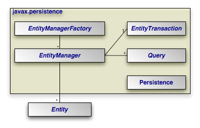
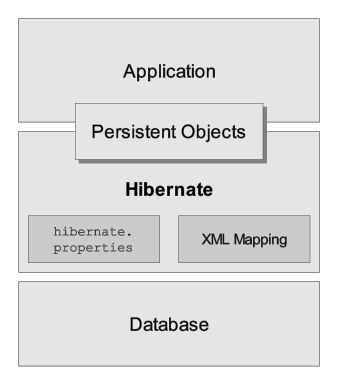
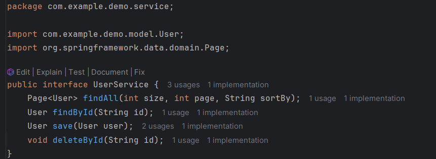
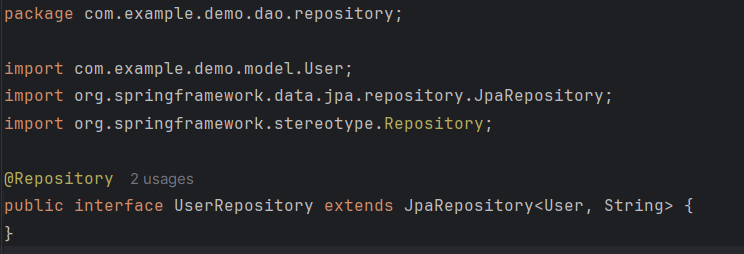
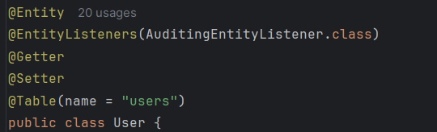
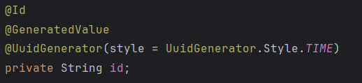
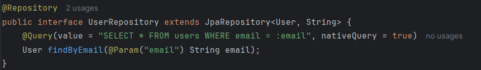

# [BUỔI 3] CRUD cơ bản
## Nội dung cần chuẩn bị:
- Triển khai RestfullAPI trong Spring Boot
- JPA là gì? Hibernate là gì?
- Tìm hiểu các Annotation : @RestController, @Service, @Repository, @Entity, @Table, @Id, @Transactional, @Query ...
- Bài tập: Làm 1 ứng dụng CRUD quản lý thông tin thành viên clb. Dùng @RestController để viết enpoint của API, dùng @Service để xử lý các logic CRUD, @Repository để xử lý thao tác với database, @Entity để tạo các ORM với dtb
- Lưu ý áp dụng tất cả các Annotation đã tìm hiểu

### I. JPA, Hibernate
#### 1. JPA
##### a. Tổng quan
- **JPA (Java Persistence API)** là 1 giao diện lập trình ứng dụng Java, nó mô tả cách quản lý các mối quan hệ dữ liệu  trong ứng dụng sử dụng Java Platform.
- JPA cung cấp một mô hình **POJO persistence** cho phép ánh xạ các table/các mối quan hệ giữa các table trong database sang các class/mối quan hệ giữa các object.
- **POJO** là những Java object mà chúng không bị hạn chế bởi bất cứ thứ gì khác. Chúng không hiện thực hay được mở rộng từ bất kỳ một class nào khác và chúng cũng không chứa bất kỳ annotation nào trong bản thân chúng. Chúng chỉ chứa các thuộc tính, các phương thức Setter, Getter của những thuộc tính đó và có thể có thêm cả các phương thức override toString() và equals().
- Ví dụ: table Users với các column (Id, name, age…) sẽ tương ứng với class Users.java với các field Id, name, age… từ đó mỗi khi truy vấn table hay các column ta sẽ truy vấn trực tiếp trên các class, các field của class mà không cần quan tâm tới việc đang dùng loại database nào, dữ liệu database ra sao…
##### b. Một số khái niệm JPA
- **Entity:** Entity là các đối tượng thể hiện tương ứng 1 table trong cơ sở dữ liệu. Khi lập trình, **entity** thường là các class POJO đơn giản, chỉ gồm các method getter, setter.
- **EntityManager:** EntityManager là một giao diện (interface) cung cấp các API cho việc tương tác với các Entity như Persist (lưu một đối tượng mới), merge (cập nhật một đối tượng), remove (xóa 1 đối tượng).
- **EntityManagerFactory:** EntityManagerFactory được dùng để tạo ra một thể hiện của EntityManager.
- Kiến trúc:

    
#### 2. Hibernate
- **Hibernate** là 1 ORM (Object Relational Mapping) framework cho phép người lập trình thao tác với database một cách hoàn toàn tự nhiên thông qua các đối tượng. Lập trình viên hoàn toàn không cần quan tâm đến loại database sử dụng, SQL…
- Hay nói cách khác, **Hibernate** chính là cài đặt của JPA (JPA là 1 tập các interface, còn Hibernate implements các interface ấy 1 cách chi tiết).
- Kiến trúc Hibernate

    

### II. Các annotation
#### 1. @RestController, @Service, @Repository
##### a. @RestController
- **@RestController** là một phiên bản đặc biệt của controller, nó được kết hợp bởi **@Controller và @ResponseBody** giúp cho việc xây dựng các RESTful API được dễ dàng hơn, đơn giản hơn.
- Ví dụ: sử dụng @RequestMapping để chỉ đường dẫn tới source chung là book-rest và sử dụng annotation @GetMapping để đánh dấu phương thức này là GET.

    ```java
    @RestController
    @RequestMapping("books-rest")
    public class SimpleBookRestController {
        
        @GetMapping("/{id}", produces = "application/json") // Trả dữ liệu dạng Json
        public Book getBook(@PathVariable int id) {
            return findBookById(id);
        }
    
        private Book findBookById(int id) {
            // ...
        }
    }
    ```
##### b. @Service
-  Đánh dấu một Class là tầng Service, phục vụ các logic nghiệp vụ.

    
##### c. @Repository
- Đánh dấu một Class Là tầng Repository, phục vụ truy xuất dữ liệu.

    
#### 2. @Entity, @Table, @Id
##### a. @Entity
- Mọi entity đều phải gắn @Entity. Hibernate sẽ dựa vào thông tin này để mapping xuống một bảng trong database. 
- Nếu @Entity không có tham số, **tên của entity này trong database sẽ là tên của class**. Nếu truyền tham số name vào thì sẽ custom được tên bảng.

    
##### b. @Id
- Mỗi Entity đề phải có một id, id dùng để định danh, phân biệt giữa các bản ghi với nhau, đã là id thì nó phải unique. Id là được dùng để làm khóa chính của bảng.

    
##### c. @Table
- Mặc định tên table dưới database cũng sẽ giống với Entity class. Trong trường hợp tên table và tên entity không giống nhau, có thể sử dụng @Table annotation để chỉ rõ table tương ứng với entity name.
- Ví dụ:

    
- **Phân biệt giữa @Entity(name = ‘EntityName’) và @Table(name = “TableName”):** @Entity(name = ‘EntityName’) dùng để chỉ tên của entity được Hibernate quản lý trong khi @Table(name = “TableName”) chỉ đích danh tên của table dưới database.

#### 3. @Transactional
- **@Transactional** là một annotation mạnh mẽ trong Spring Boot, được sử dụng để quản lý các giao dịch (transaction) trong ứng dụng. 
- Khi một phương thức được đánh dấu bằng annotation này, Spring sẽ tự động bắt đầu, cam kết (commit) hoặc hoãn lại (rollback) một giao dịch, đảm bảo tính nhất quán của dữ liệu trong cơ sở dữ liệu.
- Ví dụ:

    ```java
    @Service
    public class MyService {

        @Transactional
        public void updateData() {
            // Các hoạt động cập nhật dữ liệu
            // ...

            // Nếu có lỗi xảy ra, giao dịch sẽ bị hoãn lại
        }
    }
    ```
- Trong ví dụ trên, khi phương thức updateData() được gọi, Spring sẽ bắt đầu một giao dịch. Nếu tất cả các hoạt động trong phương thức này thành công, giao dịch sẽ được cam kết, các thay đổi đối với cơ sở dữ liệu sẽ được lưu lại. Ngược lại, nếu có bất kỳ ngoại lệ nào xảy ra, giao dịch sẽ bị hoãn lại và tất cả các thay đổi sẽ bị hủy bỏ.

#### 4. @Query
- **@Query** trong Spring Boot là một annotation được sử dụng để định nghĩa các câu truy vấn HQL (Hibernate Query Language) hoặc SQL tùy chỉnh trong các repository.

    