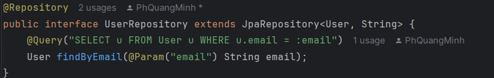
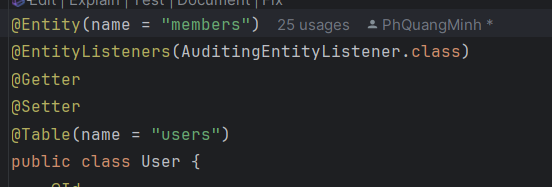
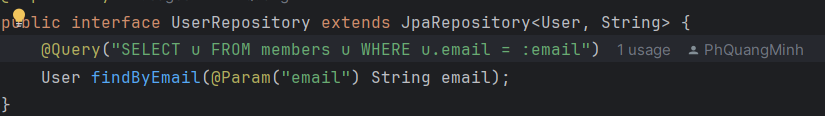
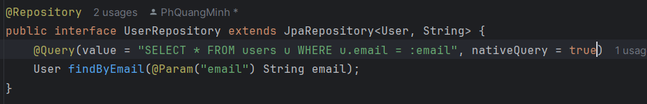
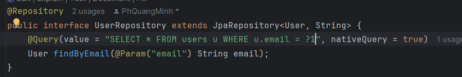
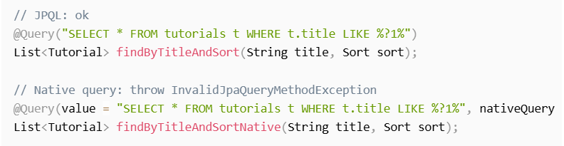
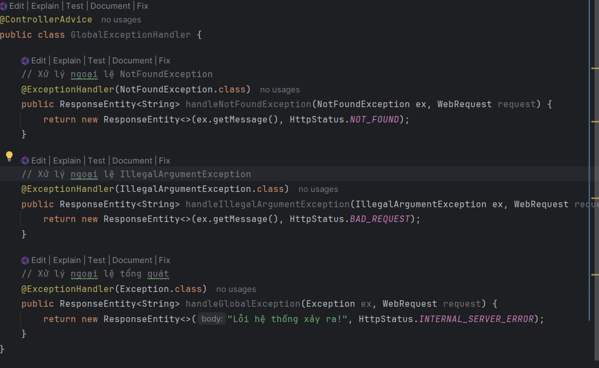

# [BUỔI 4] Các QUAN HỆ TRONG JPA, JPA NATIVE QUERY, VaLiDATION, Handling exeption và Optimize query
- Các mối quan hệ(1..N, N..N) trong JPA (@ManyToMany, @OneToMany,...)
- Jpa native query
- Validation (@Valid, @NotNull, @Nullable, @Length, ...)
- Xử lý ngoại lệ (@ControllerAdvice)
- Tối ưu query khi sử dụng JPA (n+1 query,...)
- Bài tập: Làm 1 ứng dụng CRUD quản lý thư viện. Các entity tối thiểu : Library ,Author, Book. Dùng các annotation quan hệ @ManyToMany, @OneToMany để thiết lập các quan hệ giữa entity. Sử dụng các anntation validation để kiểm tra dữ liệu. Dùng @ControllerAdvice để xử lý các lỗi và ngoại lệ có thể xảy ra.

## I. Các mối quan hệ(1..N, N..N) trong JPA (@ManyToMany, @OneToMany,...)
### 1. @ManyToMany
- Một thực thể A có thể liên kết với nhiều thực thể B và ngược lại. Ví dụ: Một sách có thể có nhiều tác giả và một tác giả có thể viết nhiều sách.
### 2. @OneToMany
- Một thực thể A có thể liên kết với nhiều thực thể B, nhưng mỗi thực thể B chỉ liên kết với một thực thể A. Ví dụ: Một tác giả có thể viết nhiều sách, nhưng mỗi sách chỉ có một tác giả chính.
## II. Jpa navtive query
### 1. JPQL và native query
- **The Jakarta Persistence Query Language (JPQL; trước đây Java Persistence Query Language)** là ngôn ngữ truy vấn hướng đối tượng độc lập với nền tảng được xác định là một phần của đặc tả Jakarta Persistence (JPA; trước đây là Java Persistence API)
- **Jakarta Persistence (trước đây gọi là Java Persistence API - JPA)** là một đặc tả Java để quản lý dữ liệu quan hệ trong các ứng dụng Java. Nó cung cấp một cách tiêu chuẩn để ánh xạ các đối tượng Java (Entities) với các bảng trong cơ sở dữ liệu quan hệ và thực hiện các thao tác CRUD (Create, Read, Update, Delete) một cách dễ dàng. 
- Ví dụ:

    
- Ở đây JPQL sẽ dùng tên của Class làm bảng để select các giá trị, muốn thay sử dụng một tên khác thì có thể sử dụng:

    
- Lúc này thì phải sửa: 

    

- **JPQL** chỉ hỗ trợ một tập hợp con của tiêu chuẩn SQL. Nếu muốn thực hiện các truy vấn phức tạp(join,...) thì có thể sử dụng Native SQL Query.
- Đây là cách thực thi SQL native query trong Spring Boot với annotation @Query:
    - Khai báo SQL trong thuộc tính **value**
    - Set the nativeQuery = true
- Cách 1: Đặt tên cho biến

    
- Cách 2: Theo thứ tự biến

    
- **Lưu ý:**
    - Viết câu lệnh truy vấn phù hợp RDBMS
    - Native Query không hỗ trợ sắp xếp động, thay vào đó sử dụng pagable để sắp xếp

        
## III. Validation
### 1. @Valid
- **@Valid** được sử dụng để kích hoạt cơ chế xác thực trên các đối tượng hoặc danh sách các đối tượng. Nó thường được sử dụng ở cấp controller để xác thực các đối tượng request trước khi xử lý.
### 2. @NotNull
- **@NotNull** được sử dụng để đảm bảo rằng giá trị của một trường không được phép là null.
### 3. @Nullable
- **@Nullable** thường được sử dụng để chỉ ra rằng một trường, phương thức hoặc tham số phương thức có thể có giá trị là null.
### 4. @Length
- **@Length** là một annotation từ Hibernate Validator, được sử dụng để giới hạn độ dài của một chuỗi (String).
### 5. @Size
- **@Size** được sử dụng để chỉ định kích thước (độ dài) tối thiểu và tối đa của các Collection, Map, hoặc Array. Đối với String, nó giới hạn số lượng ký tự.
### 6. @Min và @Max
- @Min và @Max được sử dụng để đảm bảo giá trị của một trường kiểu số (Integer, Long, etc.) nằm trong một phạm vi nhất định.
### 7. @Email
- **@Email** được sử dụng để xác nhận rằng một chuỗi là một địa chỉ email hợp lệ.
## IV. Xử lý ngoại lệ (@ControllerAdvice)
- Trong Spring, **@ControllerAdvice** là một annotation mạnh mẽ được sử dụng để xử lý ngoại lệ một cách tập trung cho toàn bộ ứng dụng.

    
## V. Tối ưu query khi sử dụng JPA (n+1 query,...)
### 1. Vấn Đề N+1 Query
- Vấn đề N+1 query xảy ra khi thực hiện một truy vấn để lấy danh sách các thực thể (N) và sau đó JPA thực hiện thêm một truy vấn riêng biệt cho từng thực thể để lấy dữ liệu liên quan (1). Điều này dẫn đến số lượng truy vấn lớn hơn nhiều so với cần thiết, gây ra hiệu suất kém.

- Ví dụ, có một Author và nhiều Book. Khi truy vấn tất cả Author và cần tất cả Book liên quan, có thể xảy ra vấn đề N+1:

    ```java
    List<Author> authors = authorRepository.findAll(); // 1 query
    for (Author author : authors) {
        List<Book> books = author.getBooks(); // N queries
    }
    ```
### 2. Sử Dụng @Fetch(FetchType.LAZY) và @Fetch(FetchType.EAGER)
- **FetchType.LAZY:** Chỉ truy vấn khi cần thiết. Điều này giúp giảm thiểu truy vấn không cần thiết nhưng có thể dẫn đến N+1 query nếu không sử dụng đúng cách.
- **FetchType.EAGER:** Tự động lấy dữ liệu liên quan ngay khi truy vấn thực thể chính. Tuy nhiên, nếu không quản lý đúng cách, điều này có thể gây ra vấn đề tải quá nhiều dữ liệu.
- Cách tốt nhất là để mặc định @ManyToOne là EAGER và @OneToMany, @ManyToMany là LAZY, và sau đó sử dụng JOIN FETCH khi cần.

### 3. Sử Dụng JOIN FETCH trong JPQL
- Để giải quyết vấn đề N+1, bạn có thể sử dụng JOIN FETCH trong JPQL để lấy dữ liệu liên quan cùng một lúc.

    ```java
    @Query("SELECT a FROM Author a JOIN FETCH a.books")
    List<Author> findAllAuthorsWithBooks();
    ```