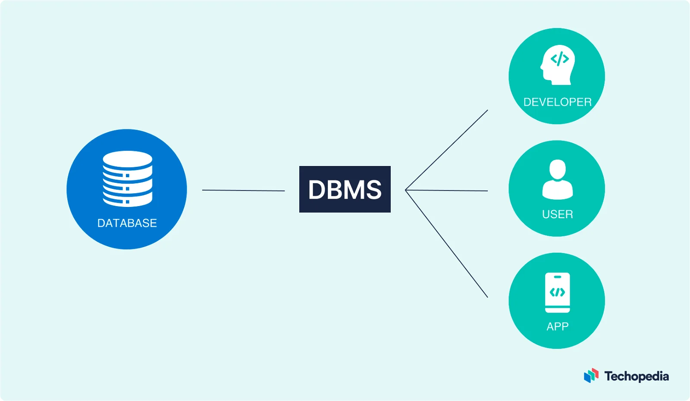
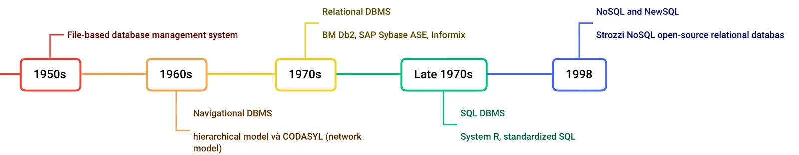
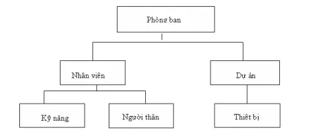
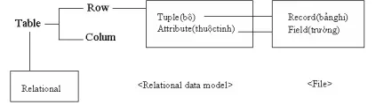
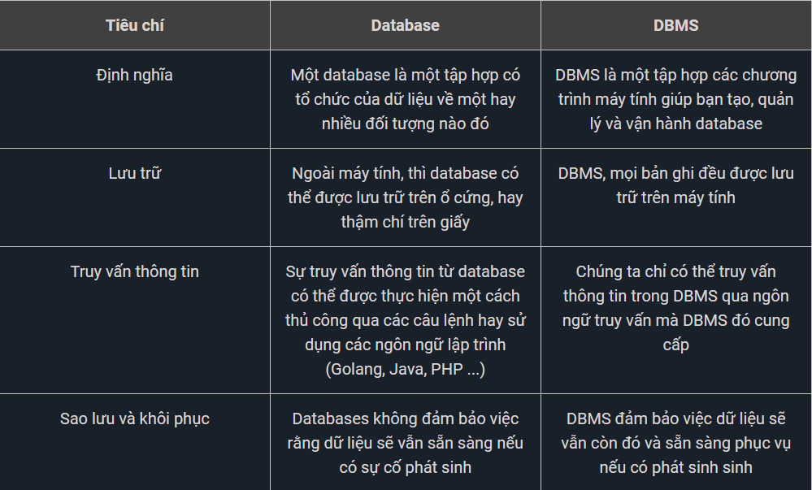
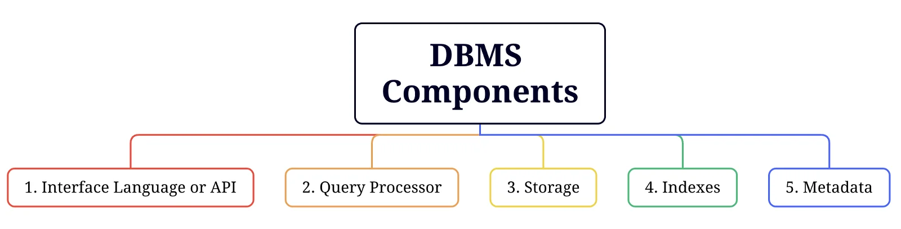
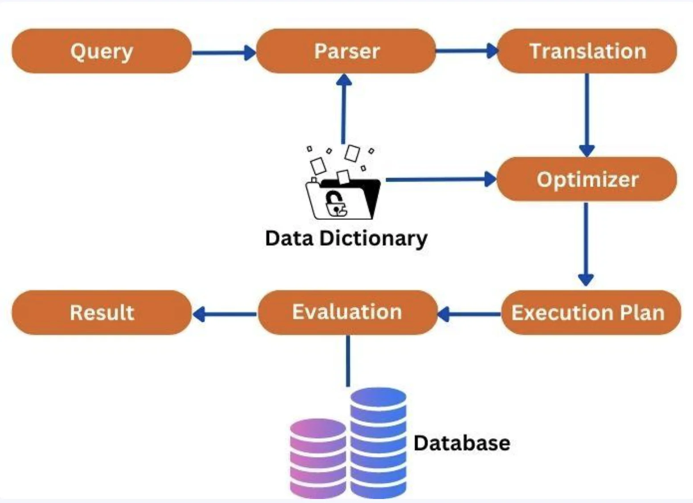

# [BUỔI 1] NHẬP MÔN CSDL
## Nội dung cần chuẩn bị
+ CSDL là gì ?
+ Hệ quản trị CSDL là gì ?
+ Cài đặt MS SQL Server
+ Câu lệnh tạo database, table trong MS SQL Server

### I. CSDL

#### 1. Giới thiệu về Cơ Sở Dữ Liệu - Database
- **Cơ sở dữ liệu(Database)** là tập hợp dữ liệu có tổ chức được lưu trữ và truy xuất trên thiết bị điện tử thông qua việc sử dụng **hệ quản trị cơ sở dữ liệu (DBMS).**
- Những database nhỏ có thể được lưu trữ trên hệ thống tệp tin của một máy tính, trong khi những database lớn có thể được lưu trữ trên các cụm máy tính hoặc trên môi trường cloud.
#### 2. Lịch sử phát triển của Cơ Sở Dữ Liệu - Database

- **Những năm 1950 (1950s)**: Thời điểm này, các máy tính vẫn sử dụng băng từ để lưu trữ thông tin, dữ liệu lúc này được tổ chức thành các tệp tin để lưu trữ và truy xuất thông tin.

- **Những năm 1960 (1960s)**: Hệ thống quản lý cơ sở dữ liệu phân cấp (hierarchical database management system) được ra đời. Các hệ thống này lưu trữ dữ liệu dưới dạng cây, trong đó, mỗi bản ghi có thể có nhiều bản ghi con.


- **Những năm 1970 (1970s):** Bắt đầu xuất hiện khái niệm về mô hình dữ liệu dạng quan hệ (Relational Model)> Ví dụ: bảng, cột, dòng, thực thể, thuộc tính...


- **Cuối những năm 1970 (Late 1970s):** Bản tiêu chuẩn của ngôn ngữ truy vấn dữ liệu (Structured Query Language - SQL) được giới thiệu và sử dụng. SQL cung cấp bộ cú pháp đầy đủ và tiện lợi cho người dùng dễ dàng tương tác với dữ liệu của mình.

- **Năm 1998:** NoSQL ra đời với kỳ vọng có thể xử lý được những dạng dữ liệu không có cấu trúc hoặc bán cấu trúc và có tốc độ xử lý nhanh hơn. Khi nhắc đến NoSQL, chúng ta có thể hiểu theo một trong hai nghĩa là không dùng SQL (No SQL systems ) hoặc không chỉ là (Not only SQL)

> link: https://viblo.asia/p/ly-thuyet-chung-ve-co-so-du-lieu-3P0lPqyv5ox
### II. Hệ quản trị CSDL
#### 1. Định nghĩa
- **DBMS (Database management system) hay hệ quản trị cơ sở dữ liệu** là phần mềm tương tác với người dùng cuối, ứng dụng và chính cơ sở dữ liệu để thu thập và phân tích dữ liệu.
#### 2. Sự khác nhau giữa Cơ Sở Dữ Liệu và Hệ Quản Trị Cơ Sở Dữ Liệu (DBMS)


#### 3. Các thành phần của Hệ Quản Trị Cơ Sở Dữ Liệu

##### 3.1. Interface Language or API
- Để có thể giao tiếp với database, các DBMS đều có tích hợp trong mình những công cụ để người sử dụng hay các phần mềm khác có thể tương tác được, chúng được gọi là **Interface Language hay API**. Nhìn chung các DBMS thường cung cấp các 5 loại ngôn ngữ tương tác sau:

##### 3.2. Query Processor
- Đây có thể coi là bộ não của DBMS bởi nó sẽ tiếp nhận các yêu cầu từ bên ngoài, xử lý các yêu cầu đó rồi trả về kết quả. Tuỳ thuộc vào các DBMS khác nhau, quá trình xử lý câu lệnh trong Query Processor cũng có thể khác nhau. Nhưng nhìn chung, khi tiếp nhận một câu lệnh, các DBMS sẽ xử lý qua các bước như trong ảnh dưới đây:


Các bước xử lý trong Query Processor của DBMS
##### 3.3. Storage
- Lưu trữ dữ liệu là tác vụ bắt buộc, không thể thiếu của bất kỳ database nào. Và để có thể tối ưu cho từng quá trình, dữ liệu trên database của bạn có thể được lưu trữ ở các ví trí khác nhau với tốc độ truy cập khác nhau.

##### 3.4. Indexes
- Nếu database chỉ đơn thuần lưu trữ dữ liệu và thực hiện tìm kiếm một cách tuần tự khi truy vấn, thì quá trình tìm kiếm sẽ rất lâu. Vì vậy trong các DBMS thường có khu vực riêng giành cho việc phân loại và sắp xếp, đánh dấu dữ liệu từ trước để đến khi truy vấn, từ đó có được kết quả nhanh hơn. Khu vực này gọi là Indexes của DBMS.

##### 3.5. Metadata
- Để có thể quản lý được dữ liệu thì phải cần thông tin về những dữ liệu được lưu trữ đó, những thông tin đó được gọi là metadata. Metatdata giúp tổ chức, tìm kiếm và hiểu về dữ liệu đang được lưu trữ. Ví dụ khi chụp một bức ảnh bằng điện thoại, thì bản thân bức ảnh đó là data, còn metadata là các thông tin về bức ảnh đó như tên, định dạng, kích thước, ngày giờ chụp...

>https://200lab.io/blog/co-so-du-lieu-la-gi/

### III. Câu lệnh tạo database, table 
#### 1. Database
##### a. Tạo database
```
CREATE DATABSE Ten_database
Ví dụ: create database Student 
```
##### b. Xóa database
```
DROP DATABASE Ten_database
Ex: drop datase Student
```
#### 2. Tablse
##### a. Tạo bảng mới
```
CREATE TABLE new_table_name AS
    SELECT column1, column2,...
    FROM existing_table_name
Ví dụ:  
CREATE TABLE STUDENT(
    id int,
    name varchar(50),
    address varchar(50),
    avg float
)
```
##### b. Tạo bảng từ bảng có sẵn
- Lấy tất cả thông tin từ bảng có sẵn
```
select * into ten_table1 from ten_table2
Ví dụ: select * into Student1 from Student
```
- Lấy 1 số thông tin từ bảng có sẵn
```
select tt1, tt2 into ten_table1 from ten_table2
Ví dụ: select id, name into Student1 from Student
```
- join, subquery
- nchar, nvarchar
- timestem
- schema

- DI, IOC, Bean
- hypernate, JDBC, JPA
- security: jwt, oauth
- trien khai: superiver, docker, dicd
test: unit test, intergration test
realtime: websocket, socket
da luong: thread, kafka, mitvemy
cache: key value storage, redis
-micro service
call api

