# Buổi 3: SQL cơ bản
## Nội dung chuẩn bị
- Query cơ bản(SELECT, JOIN, ORDER BY, GROUP BY,...)
- SubQuery
- Fake 1000 data trong csdl vừa tạo
### I. Query cơ bản
#### 1. Select
- Câu lệnh select được sử dụng để truy vấn dữ liệu từ một bảng.
- Truy vấn tất cả các cột từ bảng Employees.

    ```sql
    select * from employees;
    ```
- Truy vấn các cột cụ thể từ bảng employees

    ```sql
    select first_name, last_name from employees;
    ```
- Lấy các dữ liệu không bị trùng lặp

    ```sql
    select distinct departmen_id
    from employees
    ```
#### 2. Where
- Dùng để lọc dữ liệu dựa trên điều kiện lọc điều kiện thường

    ```sql
    SELECT column1, column2, ...
    FROM table_name
    WHERE condition;
    ```
- Ví dụ:

    ```sql
    SELECT EmployeeID, Name
    FROM Employees
    WHERE Salary > 50000;
    ```
#### 3. Insert into
- Chèn dự liệu vào bảng:
    
    ```sql
    INSERT INTO table_name (column1, column2, ...)
    VALUES  (value1, value2, ...),
            (value1, value2, ...),
            (value1, value2, ...),
            (value1, value2, ...);   
    ```
- Ví dụ:

    ```sql
    INSERT INTO Employees (EmployeeID, Name, Salary)
    VALUES (1, 'John Doe', 60000);
    ```
#### 4. Update 
- Cập nhật dự liệu trong bảng

    ```sql
    UPDATE table_name
    SET column1 = value1, column2 = value2, ...
    WHERE condition;
    ```
- Ví dụ:

    ```sql
    UPDATE Employees
    SET Salary = 65000
    WHERE EmployeeID = 1;
    ```
#### 5. Delete
- Xóa dự liệu trong bảng

    ```sql
    DELETE FROM table_name
    WHERE condition;
    ```
- Ví dụ:

    ```sql
    DELETE FROM Employees
    WHERE EmployeeID = 1;
    ```
- Truncate
- Union
#### 6. Join
- Câu lệnh join được sử dụng để kết hợp các hàng từ hai hoặc nhiều bảng dựa trên một điều kiện chung.
##### a. Inner join
- Inner join trả về các hàng khi có sự trùng khớp giữa hai bảng.

    ```sql
    select employees.employee_id, employees.first_name, departments.name
    from employees
    inner join departments on employees.department_id = departments.department_id
    ```
- Câu truy vấn trên sẽ trả về danh sách nhân viên và tên phòng ban tương ứng của họ, đó là những nhân viên có mã phòng ban trùng khớp với mã phòng ban của bảng departments.
##### b. Left join
- Left join trả về tất cả các hàng từ bảng bên trái và các hàng khớp với bảng bên phải. Nếu không có sự khớp, kết quả từ bảng bên phải sẽ là NULL.

    ```sql
    select employees.employee_id, employees.first_name, departments.name
    from employees
    left join departments on employees.department_id = departments.department_id
    ```
- Bảng bên trái sẽ là employees, bảng bên phải sẽ là departments.
- Ví dụ:
    - Bảng bên trái:
    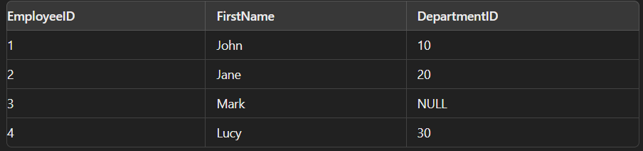
    - Bảng bên phải:
    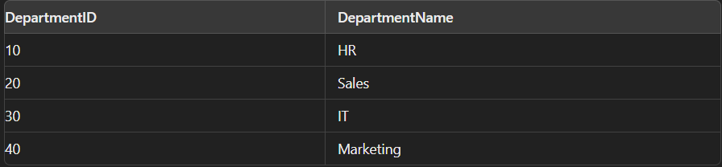
    - Kết quả là:
    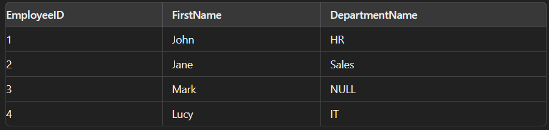
##### c. Right join
- Right join trả về tất cả các hàng từ bảng bên phải và các hàng khớp với bảng bên trái. Nếu không có sự khớp, kết quả từ bảng bên trái sẽ là NULL.

    ```sql
    select employees.employee_id, employees.first_name, departments.name
    from employees
    right join departments on employees.department_id = departments.department_id
    ```
- Bảng bên phải sẽ là employees, bảng bên trái sẽ là departments.
- Ví dụ: Tương tự left join
##### d. full join
- Full join trả về tất cả các hàng khi có sự khớp trong một trong hai bảng. Nếu không có sự khớp, kết quả từ bảng không khớp sẽ là NULL.
    
    ```sql
    select employees.employee_id, employees.first_name, departments.name
    from employees
    full join departments on employees.department_id = departments.department_id
    ```
- Ví dụ:
    - Bảng employees:   
    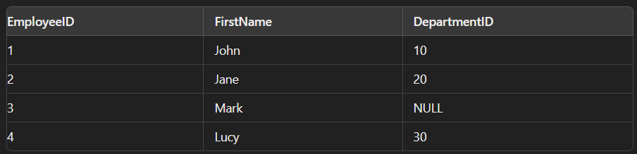
    - Bảng department:
    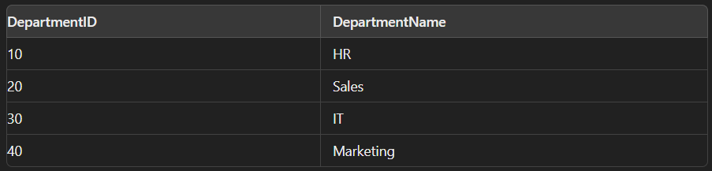
    - Kết quả:
    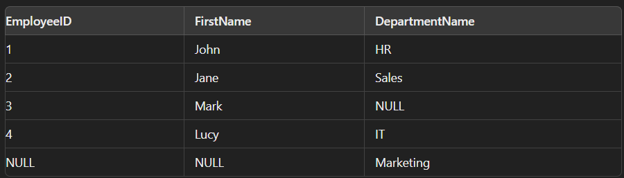
#### 7. Order by
- Câu lệnh Order by được sử dụng để sắp xếp kết quả theo một hoặc nhiều cột.
- Truy vấn tất cả các cột từ bảng employees và sắp xếp first_name theo thứ tự tăng dần

    ```sql
    select * from employees
    order by first_name
    ```
- Truy vấn tất cả các cột từ bảng employees và sắp xếp first_name theo thứ tự tăng dần giảm dần.

    ```sql
    select * from employees
    order by first_name desc
    ```
#### 8. Group by
- Group by sử dụng để nhóm các hàng có cùng giá trị vào các tập hợp.
- Ví dụ truy vấn số lượng nhân viên trong mỗi phòng ban:

    ```sql
    select department_id, count(*) as number_employees
    from employees
    group by departmen_id
    order by number_employees desc
    ```
- Ngoài hàm count(), còn có các hàm min(), max(), sum(), avg().
#### 9. Having
- Having được sử dụng để lọc các nhóm hoặc tập hợp các hàng sau khi sử dụng group by.
- Having phải sự dùng hàm vì các điều kiện thường sẽ lọc bằng where, ở having, khi tồn tại 2 bản ghi khác nhau ở phần having thì nó sẽ không thỏa mãn.
- Ví dụ:
    
    ```sql
5    select department_id, count(*) as number_employees

1    from employees

2    where abc>=0

3    group by departmen_id
4
    having count(*) > 5
    ```
### II. Subquery
> Link: https://www.sqlservertutorial.org/sql-server-subquery/
#### 1. Overview
- **SUBQUERY** là một truy vấn SQL trong câu lệnh SQL. Truy vấn con có thể là một phần của câu lệnh **SELECT, INSERT, UPDATE hoặc DELETE** và **bản thân nó luôn là truy vấn SELECT**. 
- Một truy vấn con cũng có thể có một truy vấn con khác bên trong nó. Truy vấn con trong truy vấn con được gọi là NESTED SUBQUERY và hiện tượng này được gọi là NESTING. 
- SQL Server hỗ trợ 32 cấp độ lồng nhau, tức là 32 truy vấn con trong một câu lệnh. SUBQUERY còn được gọi là INNER QUERY hoặc INNER SELECT.
#### 2. Các loại truy vấn con
- Truy vấn con phải được **đặt trong dấu ngoặc đơn hoặc dấu ngoặc đơn trong mệnh đề SQL.** Tùy thuộc vào mục đích và vị trí của truy vấn con trong câu lệnh SQL, chúng ta có thể xác định 3 loại truy vấn con:
    - Subquery in SELECT clause
    - Subquery in FROM clause
    - Subquery in WHERE clause
- Ví dụ có các bảng sau:
    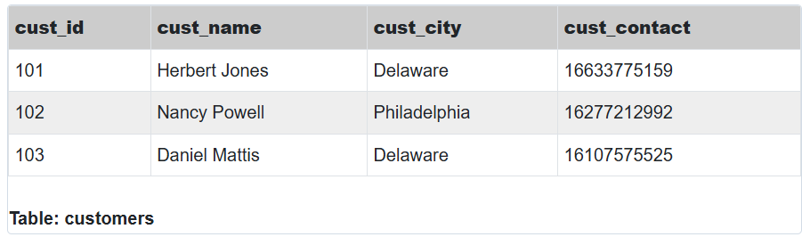
    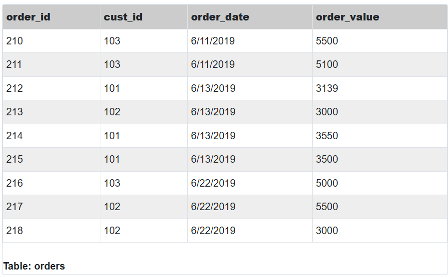
#### 3. Subquery in SELECT clause
- Được dùng để trả về giá trị cho các cột trong phần select

    ```sql
    SELECT order_id, order_date, order_value
    FROM orders
    WHERE cust_id IN
    (SELECT cust_id FROM customers WHERE cust_city='Philadelphia')
    ORDER BY order_value DESC;
    ```
- Kết quả nhận được: 
    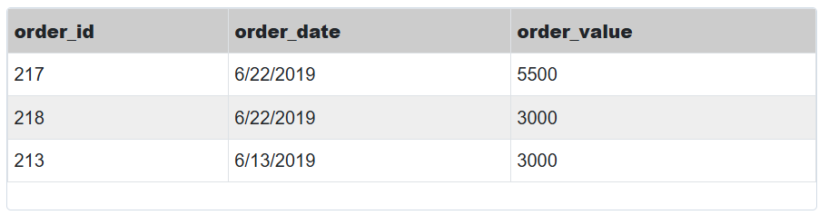
#### 4. Subquery in FROM clause
- Được dùng để cung cấp một tập hợp các giá trị cho phần From.

    ```sql
    SELECT c.cust_name,
    (SELECT avg(order_value) FROM orders o WHERE o.cust_id = c.cust_id) as av_order_value
    FROM customers c;
    ```
- Kết quả nhận được:
    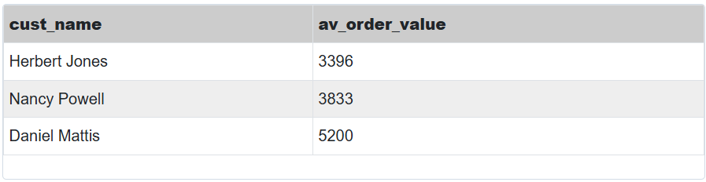
#### 5. Subquery in WHERE clause
- Dùng để lọc dữ liệu trong phần WHERE.
    ```sql
    SELECT c.cust_id, c.cust_name, o.tot_val
    FROM
    (SELECT cust_id, sum(order_value) tot_val
    FROM orders group by cust_id) o
    INNER JOIN customers c ON o.cust_id=c.cust_id;
    ```
- Kết quả nhận được:
    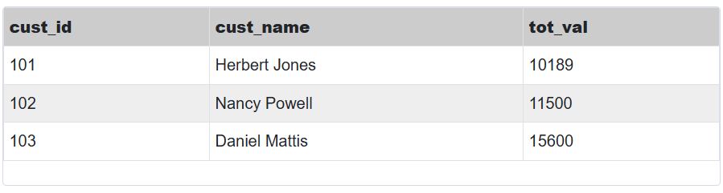