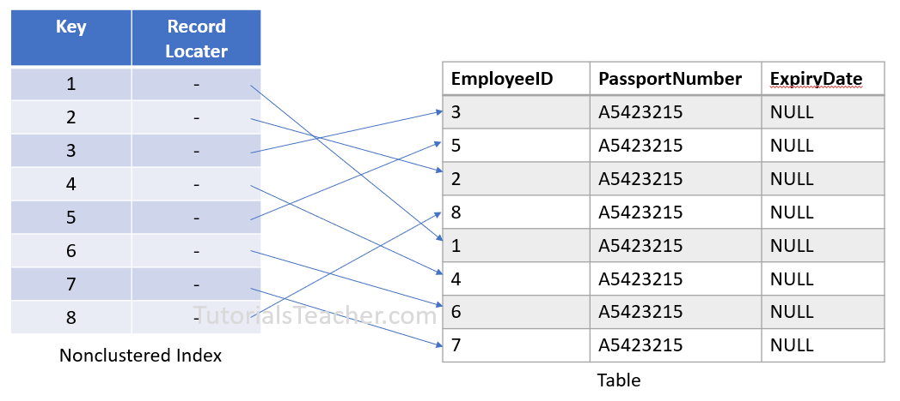

# [BUỔI 4] SQL NÂNG CAO
## Nội dung chuẩn bị
- Index
- Transaction
### I. Index
#### 1. Tổng quan
##### a. Định nghĩa
- **Index(Chỉ mục) trong SQL Server** là một cấu trúc dữ liệu đặc biệt được sử dụng để tăng tốc độ truy xuất dữ liệu từ một bảng. 
- **Ví dụ:** Một bảng mục lục của một cuốn sách: khi muốn tìm kiếm một thông tin cụ thể, sẽ tham khảo bảng mục lục để nhanh chóng định vị trang chứa thông tin đó.

##### b. Lý do sử dụng
- **Tăng tốc độ truy vấn:** Index giúp giảm thiểu thời gian SQL Server phải quét toàn bộ bảng để tìm kiếm dữ liệu, đặc biệt là đối với các truy vấn phức tạp hoặc các bảng lớn.
- **Cải thiện hiệu suất:** Việc sử dụng index hợp lý giúp giảm tải cho CPU và I/O, từ đó nâng cao hiệu suất tổng thể của hệ thống cơ sở dữ liệu.

##### c. Cách sử dụng Index
- Khi nào nên sử dụng Index: 
    - **Các cột thường xuyên được sử dụng trong mệnh đề WHERE:** Tạo index trên các cột này giúp tăng tốc độ lọc dữ liệu.
    - **Các cột được sử dụng trong mệnh đề ORDER BY:** Tạo index giúp sắp xếp dữ liệu nhanh hơn.
    - **Các cột được sử dụng trong mệnh đề JOIN:** Tạo index trên các cột tham gia vào liên kết giúp cải thiện hiệu suất của các truy vấn JOIN.
- Khi nào không nên sử dụng Index:
    - **Các bảng nhỏ:** Đối với các bảng nhỏ, chi phí tạo và duy trì index có thể lớn hơn lợi ích mang lại.
    - **Các cột thường xuyên được cập nhật:** Việc cập nhật dữ liệu trong một cột có index sẽ làm chậm quá trình cập nhật, vì index cũng cần được cập nhật.
    - **Các cột có nhiều giá trị null:** Index trên các cột có nhiều giá trị null thường không hiệu quả.
#### 2. Các loại Index
##### a. Index đơn cột(Single-column index)
- **Định nghĩa:** Tạo chỉ mục trên một cột duy nhất.
- **Ưu điểm:**
    - Đơn giản và dễ quản lý.
    - Tối ưu hóa các truy vấn có điều kiện tìm kiếm trên cột đó.
- **Hạn chế:**
    - Không hiệu quả với các truy vấn yêu cầu điều kiện trên nhiều cột.

    ```SQL
    CREATE INDEX NameIndex
    On TableName (ColumnName)
    ```
##### b. Index đa cột(Multi-Column Index)
- **Định nghĩa:** Là chỉ mục được tạo trên nhiều cột cùng một lúc.
- **Ưu điểm:**
    - Tối ưu hóa các truy vấn có điều kiện tìm kiếm hoặc sắp xếp theo nhiều cột.
- **Hạn chế:**
    - Chỉ có thể sử dụng index này hiệu quả với các truy vấn có điều kiện theo đúng thứ tự của các cột trong chỉ mục.

    ```sql
    CREATE INDEX NameIndex
    ON TableName (Column1, Column2);
    ```
##### c. Index Unique
- **Định nghĩa:** Là chỉ mục đảm bảo rằng tất cả các giá trị trong cột (hoặc tập hợp các cột) được chỉ mục là duy nhất.
- **Ưu điểm:**
    - Đảm bảo tính duy nhất của dữ liệu trong cột, ngăn chặn việc chèn các giá trị trùng lặp.
    - Tự động tạo ra constraint UNIQUE trong cơ sở dữ liệu.
- **Hạn chế:**
    - Không thể chèn giá trị trùng lặp vào cột được chỉ mục.
    
    ```sql
    CREATE UNIQUE INDEX NameIndex
    On TableName (ColumnName)
    ```
##### d. Index Clustered
- **Định nghĩa:** Là chỉ mục quyết định thứ tự vật lý của các hàng trong bảng. Mỗi bảng chỉ có thể có một chỉ mục clustered.
- **Ưu điểm:**
    - Cải thiện hiệu suất truy vấn khi dữ liệu được truy xuất theo thứ tự đã được sắp xếp.
    - Hữu ích cho các truy vấn với điều kiện ORDER BY hoặc JOIN.
- **Hạn chế:**
    - Chỉ có thể có một index clustered cho mỗi bảng.
    - Thay đổi chỉ mục clustered có thể tốn thời gian và gây ảnh hưởng lớn đến bảng.

    ```sql
    CREATE CLUSTERED INDEX NameIndex
    ON TableName (ColumnName);
    ```
##### e. Index Non-Clustered
- **Định nghĩa:** **Non-Clustered** không sắp xếp các hàng dữ liệu về mặt vật lý. Nó tạo ra một cấu trúc khóa-giá trị riêng biệt từ dữ liệu bảng trong đó khóa chứa các giá trị cột (trên đó chỉ mục không được nhóm được khai báo) và **mỗi giá trị chứa một con trỏ tới hàng dữ liệu chứa giá trị thực**. 
- Nó tương tự như một cuốn sách giáo khoa có mục lục ở cuối sách với số trang chỉ ra thông tin thực tế.

- **Ưu điểm:**
    - Có thể tạo nhiều chỉ mục non-clustered trên một bảng(999 cái), giúp tối ưu hóa nhiều loại truy vấn khác nhau.
    - Không thay đổi thứ tự vật lý của dữ liệu trong bảng.
- **Hạn chế:**
    - Thực hiện thêm bước để tra cứu dữ liệu từ chỉ mục đến bảng chính, có thể làm giảm hiệu suất trong một số trường hợp.

    ```sql
    CREATE NONCLUSTERED INDEX NameIndex
    ON TableName (ColumnName);
    ```
>Link: https://www.tutorialsteacher.com/sqlserver/nonclustered-index

#### 3. Các thao tác trên Index
- Xem các Index hiện tại:

    ```sql
    SELECT *
    FROM sys.indexes
    WHERE object_id = OBJECT_ID('TableName');
    ```
- Xóa Index

    ```sql
    DROP INDEX IndexName ON TableName
    ```
- Tái tạo Index

    ```sql
    ALTER INDEX IndexName ON TableName REBUILD
    ```
- Tối ưu Index

    ```sql
    ALTER INDEX ALL ON TableName REORGANIZE
    ```

### II. TRACSACTION
#### 1. Tổng quan
##### a. Định nghĩa
- **Transaction** là một tập hợp các câu lệnh SQL được thực thi như một đơn vị công việc duy nhất. Điều này có nghĩa là **tất cả các câu lệnh trong transaction sẽ được thực thi thành công hoặc thất bại cùng một lúc**, đảm bảo tính nhất quán của dữ liệu trong cơ sở dữ liệu.
- Đặc điểm của Transaction:
    - Bảo toàn
    - Nhất quán
    - Độc lập
    - Bền bỉ
> Link: https://viettuts.vn/sql/transaction-trong-sql
##### b. Lý do sử dụng Transaction
- **Bảo vệ tính toàn vẹn dữ liệu:** Đảm bảo rằng dữ liệu luôn ở trong trạng thái nhất quán, không bị hư hỏng.
- **Quản lý các thay đổi dữ liệu:** Cho phép thực hiện nhiều thay đổi dữ liệu liên quan đến nhau và đảm bảo tất cả các thay đổi đó được thực hiện hoặc không được thực hiện.
- **Phục hồi dữ liệu:** Trong trường hợp xảy ra lỗi, có thể khôi phục lại trạng thái trước khi transaction bắt đầu.
##### c. Ví dụ về transaction trong thực tế
- **Chuyển khoản:** Đảm bảo rằng số tiền được trừ khỏi tài khoản người gửi và cộng vào tài khoản người nhận cùng một lúc.
- **Đặt hàng:** Đảm bảo rằng việc trừ hàng tồn kho và cập nhật đơn hàng được thực hiện cùng một lúc.
- **Quản lý kho:** Đảm bảo rằng việc cập nhật số lượng hàng tồn kho và tạo hóa đơn được thực hiện cùng một lúc.
#### 2. Các lệnh điều khiển Tracsaction
- **BEGIN TRANSACTION:** Bắt đầu một transaction mới.
- **COMMIT TRANSACTION:** Lưu các thay đổi của transaction vào cơ sở dữ liệu.
- **ROLLBACK TRANSACTION:** Hủy bỏ tất cả các thay đổi của transaction và khôi phục lại trạng thái trước khi bắt đầu.
- **SAVE TRANSACTION:** Tạo một điểm lưu trữ trong transaction, cho phép bạn khôi phục lại transaction đến điểm đó sau này.
#### 3. Ví dụ về Tracsaction

```sql
    BEGIN TRANSACTION;
    BEGIN TRY
        -- Các thao tác SQL
        INSERT INTO Accounts (AccountID, Balance) VALUES (1, 1000);
        UPDATE Accounts SET Balance = Balance - 100 WHERE AccountID = 1;
        UPDATE Accounts SET Balance = Balance + 100 WHERE AccountID = 2;
        
        -- Nếu tất cả các thao tác đều thành công, commit transaction
        COMMIT TRANSACTION;
    END TRY
    BEGIN CATCH
        -- Nếu có lỗi xảy ra, rollback transaction
        ROLLBACK TRANSACTION;
        -- Xử lý lỗi (ví dụ: ghi log lỗi)
        DECLARE @ErrorMessage NVARCHAR(4000);
        SET @ErrorMessage = ERROR_MESSAGE();
        PRINT @ErrorMessage;
    END CATCH;
```
#### 4. Mức độ cô lập(Isolation level)
##### a. Định nghĩa
- **Isolation level** xác định mức độ cô lập giữa các transaction đang cùng hoạt động trên cơ sở dữ liệu. Mức độ cô lập cao hơn sẽ **ngăn chặn nhiều vấn đề liên quan đến đồng thời hóa**, nhưng đồng thời cũng làm **giảm hiệu suất.**
##### b. Ảnh hưởng transaction
- **Dirty Read:** Transaction đọc được dữ liệu chưa được commit của transaction khác, có thể dẫn đến quyết định sai lầm dựa trên dữ liệu không chính xác.
- **Non-repeatable Read:** Transaction đọc lại cùng một dữ liệu nhiều lần nhưng nhận được kết quả khác nhau do transaction khác đã cập nhật dữ liệu.
- **Phantom Read:** Transaction đọc được các bản ghi mới được thêm vào bởi transaction khác, mặc dù transaction đầu tiên đã đọc tất cả các bản ghi trước đó.
##### b. Các loại Isolation
- **READ UNCOMMITTED:**
    - Cho phép đọc dữ liệu chưa được commit của transaction khác, có thể dẫn đến hiện tượng dirty read (đọc dữ liệu chưa chính xác).
    - Hiệu suất cao nhất nhưng dễ xảy ra lỗi nhất.
- **READ COMMITTED:**
    - Chỉ cho phép đọc dữ liệu đã được commit, tránh dirty read nhưng có thể xảy ra non-repeatable read (đọc cùng một dữ liệu nhiều lần nhưng nhận được kết quả khác nhau).
- **REPEATABLE READ:**
    - Ngăn chặn dirty read và non-repeatable read nhưng có thể xảy ra phantom read (xuất hiện các bản ghi mới giữa hai lần đọc).
- **SERIALIZABLE:**
    - Mức độ cô lập cao nhất, ngăn chặn tất cả các vấn đề liên quan đến đồng thời hóa, nhưng hiệu suất thấp nhất.
##### c. Cài đặt
    ```sql
    SET TRANSACTION ISOLATION LEVEL READ COMMITTED;
    ```
<!-- ##### 5. Hiện tượng Deadlock
- Deadlock xảy ra khi hai hoặc nhiều transaction đang chờ nhau để giải phóng khóa, dẫn đến tình trạng bế tắc.
- Nguyên nhân:
    -  -->

